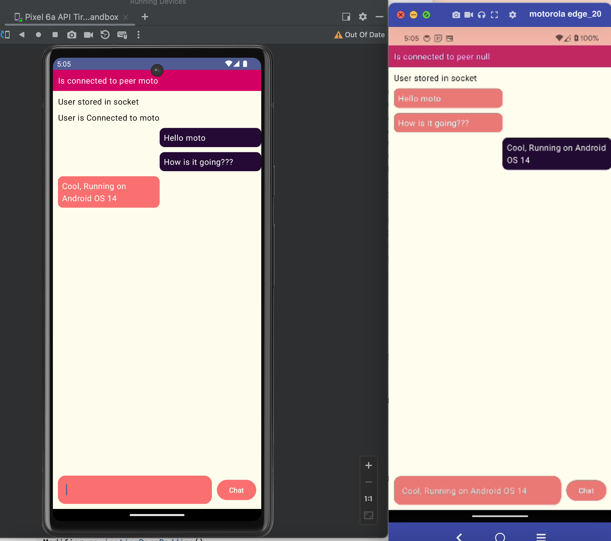
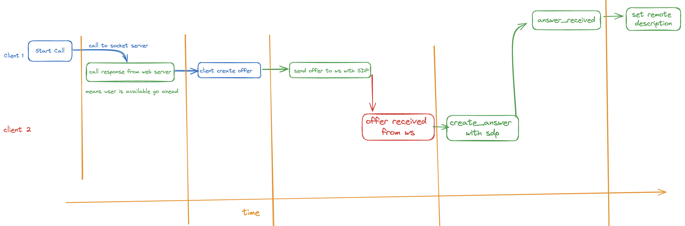
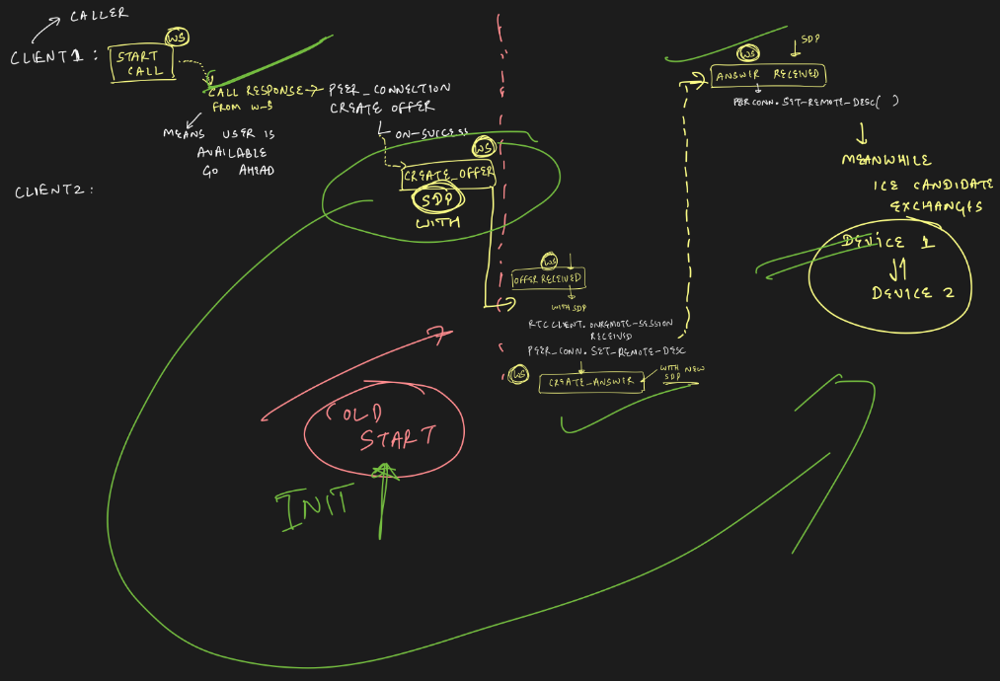

> Image taken [from](https://www.epiqglobal.com/epiq/media/thinking/blog/chat-blog-angle.jpg?ext=.jpg)

# What we would be building



# Web RTC

WebRTC is an open source project to enable realtime communication of audio, video and data in Web and native apps.

# Signalling server

WebRTC uses RTCPeerConnection to communicate streaming data between browsers, but also needs a mechanism to coordinate
communication and to send control messages, a process known as signaling. Signaling methods and protocols are not
specified by WebRTC

# STUN and TURN servers

WebRTC is designed to work peer-to-peer, so users can connect by the most direct route possible. However, WebRTC is
built to cope with real-world networking: client applications need to
traverse [NAT gateways](http://en.wikipedia.org/wiki/NAT_traversal) and firewalls, and peer to peer networking needs
fallbacks in case direct connection fails. As part of this process, the WebRTC APIs use STUN servers to get the IP
address of your computer, and TURN servers to function as relay servers in case peer-to-peer communication
fails. ([WebRTC in the real world](http://www.html5rocks.com/en/tutorials/webrtc/infrastructure/) explains in more
detail.)

# General Flow for P2P connections



# Code for Signalling server

We would simply create a Node Server, which would act as signalling server since it uses web sockets

```javascript
const { log } = require("console");

const http = require("http");

const Socket = require("websocket").server;

const server = http.createServer(() => {});

server.listen(3000, () => {
  log("listening on server 3000");
});

const webSocket = new Socket({ httpServer: server });

// array contains user name and there connection objects

const users = [];

webSocket.on("request", req => {
  const connection = req.accept();

  connection.on("message", message => {
    const data = JSON.parse(message.utf8Data);

    console.log(data);

    const user = findUser(data.name);

    switch (data.type) {
      case "store_user":
        if (user != null) {
          //our user exists

          connection.send(
            JSON.stringify({
              type: "user_already_exists",

              data: data.name,
            })
          );

          log("user already existed returning");

          return;
        }

        const newUser = {
          name: data.name,
          conn: connection,
        };

        try {
          connection.send(
            JSON.stringify({
              type: "user_stored",

              data: data.name,
            })
          );

          log("user added");
        } catch (error) {
          log("error adding -> ", error);
        }

        users.push(newUser);

        break;

      case "start_transfer":
        let userToCall = findUser(data.target);

        if (userToCall) {
          connection.send(
            JSON.stringify({
              type: "transfer_response",
              data: userToCall.name,
            })
          );
        } else {
          connection.send(
            JSON.stringify({
              type: "transfer_response",
              data: null,
            })
          );
        }

        break;

      case "create_offer":
        let userToReceiveOffer = findUser(data.target);

        if (userToReceiveOffer) {
          userToReceiveOffer.conn.send(
            JSON.stringify({
              type: "offer_received",

              name: data.name,

              data: data.data.sdp,
            })
          );
        }

        break;

      case "create_answer":
        let userToReceiveAnswer = findUser(data.target);

        if (userToReceiveAnswer) {
          userToReceiveAnswer.conn.send(
            JSON.stringify({
              type: "answer_received",

              name: data.name,

              data: data.data.sdp,
            })
          );
        }

        break;

      case "ice_candidate":
        let userToReceiveIceCandidate = findUser(data.target);

        if (userToReceiveIceCandidate) {
          userToReceiveIceCandidate.conn.send(
            JSON.stringify({
              type: "ice_candidate",

              name: data.name,

              data: {
                sdpMLineIndex: data.data.sdpMLineIndex,

                sdpMid: data.data.sdpMid,

                sdpCandidate: data.data.sdpCandidate,
              },
            })
          );
        }

        break;
    }
  });

  connection.on("close", () => {
    users.forEach(user => {
      if (user.conn === connection) {
        users.splice(users.indexOf(user), 1);
      }
    });
  });

  connection.on("error", err => {
    log("error on socket, ", err);
  });
});

const findUser = username => {
  for (let i = 0; i < users.length; i++) {
    if (users[i].name === username) return users[i];
  }
};
```

# What is SDP?

SDP stands for Session Description Protocol, and it plays a vital role in WebRTC (Web Real-Time Communication)
for negotiating and establishing peer-to-peer connections between devices. SDP is a text-based protocol that describes
the multimedia capabilities and session parameters of participants in a communication session.

# A brief from code and diagram

Which is like this in following order:

1. Client 1 would express his desire to start call, and hence since signalling is not done yet so web socket would act
   as relay as of now
   1. Client 1 would get himself connected to signalling server, with some name
   2. And then if successful it would be connected to signalling server
2. For assumption we would assume that both client 1 and client 2 are now registered on signalling server.
   1. Given that they connected themselves to server by sending `store_user` message and getting apt reply as well.
3. Client 1 initiate the process, and hence asks web server (signalling server) to find if its possible to connect to
   client 2, by send `start_transfer` message
   1. if its possible then its
      1. receives `transfer_response` message with client2 name
      2. in response to this it creates an offer on`peer connection`
      3. a `create_offer` event is sent to web Socket with **SDP**
   2. Not possible journey ends here
      1. 
4. So given that client 2 is also connected to web socket, it would receive `offer_received` event with **SDP** from
   server in response to above `create_offer`
5. Now its upto client 2 to accept this offer or not
6. Given that client 2 agrees upon file transfer
   1. It set its remote description to this received **SDP**
   2. And sends `create_answer` with **SDP** as acknowledgment to server so that it can be sent to client 1
7. Now server takes this `create_answer` and send this to `answer_received`
8. Now client 1 saves this SDP from client 2 as its remote session description
9. Now ICE Candidates are exchanged between these peers i.e client 1 and client 2

# Let's get started

## Dependencies

```kts

implementation("io.getstream:stream-webrtc-android:1.1.1")
implementation("org.java-websocket:Java-WebSocket:1.5.3")
implementation("com.google.code.gson:gson:2.10")
implementation("androidx.lifecycle:lifecycle-viewmodel-compose:2.7.0")

```

## Connection with web socket

```kotlin

sealed class SocketEvents{
    data class OnSocketMessageReceived(val message: MessageModel): SocketEvents()
    data class ConnectionChange(val isConnected: Boolean): SocketEvents()
    data class ConnectionError(val error: String): SocketEvents()
}

class SocketConnection {

    private val scope = CoroutineScope(Dispatchers.IO)

    private var webSocket: WebSocketClient? = null
    private val gson = Gson()

    private val _events = MutableSharedFlow<SocketEvents>()
    val event: SharedFlow<SocketEvents>
        get() = _events

    fun initSocket(
        username: String,
    ) {

        webSocket = object : WebSocketClient(URI("ws://192.168.0.108:3000")) {
            override fun onOpen(handshakedata: ServerHandshake?) {
                Log.d(TAG, "onOpen: ${Thread.currentThread()}")
                sendMessageToSocket(
                    MessageModel(
                        "store_user", username, null, null
                    )
                )
            }

            override fun onMessage(message: String?) {
                try {
                    Log.d(TAG, "onMessage: $message")
                    emitEvent(
                        SocketEvents.OnSocketMessageReceived(
                            gson.fromJson(message, MessageModel::class.java)
                        )
                    )
                } catch (e: Exception) {
                    Log.d(TAG, "onMessage: error -> $e")
                    emitEvent(
                        SocketEvents.ConnectionError(
                            e.message ?: "error in receiving messages from socket"
                        )
                    )
                    e.printStackTrace()
                }
            }

            override fun onClose(code: Int, reason: String?, remote: Boolean) {
                Log.d(TAG, "onClose: $reason")
                emitEvent(
                    SocketEvents.ConnectionChange(
                        isConnected = false,
                    )
                )
            }

            override fun onError(ex: Exception?) {
                Log.d(TAG, "onError: $ex")
                emitEvent(
                    SocketEvents.ConnectionError(
                        ex?.message ?: "Socket exception"
                    )
                )
            }
        }
        webSocket?.connect()
    }

    private fun emitEvent(event: SocketEvents) {
        scope.launch {
            _events.emit(
                event
            )
        }
    }

    fun sendMessageToSocket(message: MessageModel) {
        try {
            Log.d(TAG, "sendMessageToSocket: $message")
            webSocket?.send(Gson().toJson(message))
        } catch (e: Exception) {
            Log.d(TAG, "sendMessageToSocket: $e")
        }
    }

}
```

We would be emitting `SocketEvents` via sharedFlow

## ViewModel, States and Actions

```kotlin

data class MainScreenState(
    val isConnectedToServer: Boolean = false,
    val isConnectToPeer: String? = null,
    val connectedAs: String = "",
    val messagesFromServer: List<String> = emptyList(),
)

sealed class MainActions {
    data class ConnectAs(val name: String) : MainActions()
    data object AcceptIncomingConnection: MainActions()
}

```

```kotlin

private const val TAG = "MainViewModel"

class MainViewModel: ViewModel() {

    private val _state = MutableStateFlow(
        MainScreenState()
    )
    val state: StateFlow<MainScreenState>
        get() = _state

    private val socketConnection = SocketConnection()

    init {
        listenToSocketEvents()
    }

    private fun listenToSocketEvents() {
        viewModelScope.launch {
            socketConnection.event.collectLatest {
                when(it){
                    is SocketEvents.ConnectionChange->{
                        if(!it.isConnected){
                            _state.update {
                                state.value.copy(
                                    isConnectedToServer = false,
                                    connectedAs = "",
                                )
                            }
                        }
                    }
                    is SocketEvents.OnSocketMessageReceived->{
                        handleNewMessage(it.message)
                    }
                    is SocketEvents.ConnectionError->{
                        Log.d(TAG, "socket ConnectionError ${it.error}")
                    }
                }
            }
        }
    }

    private fun handleNewMessage(message: MessageModel) {
        Log.d(TAG, "handleNewMessage in VM")
        when(message.type){
            "user_already_exists"->{

            }
            "user_stored"->{
                Log.d(TAG, "user stored in socket")
                _state.update {
                    state.value.copy(
                        isConnectedToServer = true,
                        connectedAs = message.data.toString(),
                    )
                }
            }
            "transfer_response"->{
                // user is online / offline
            }
            "offer_received"->{}
            "answer_received"->{

            }
            "ice_candidate"->{}
        }
    }

    fun dispatchAction(actions: MainActions){
        when(actions){
            is MainActions.ConnectAs->{
                socketConnection.initSocket(actions.name)
            }
            is MainActions.AcceptIncomingConnection->{

            }
        }
    }

}

```

## Rest of Implementation and gotchas

### RTC peer connection creation

In accordance with our code of client 1 and client 2,

- client 1 would create RTC peer object when it decided to call client 2
- but client would create RTC peer object when it receives offer from client 1, and decides to accept it

This is denoted by cold start on below diagram



### WebRTCManager

All webRTC related things are delegated to this class see code in github repo, like

- setting up data channels
- answer to any p2p offer
- setting remote session SDP to incoming SDP from socket
- creating a brand new offer
- create data channels, and send exposing received from peer connection's data channel as sharedFlow

### Handling own's send message

Unable to see own's sent message in UI Activity, as a workaround emitted message in shared flow directly. You know a
better solution, please do drop a comment.

# Resources

[Webrtc-infrastructure](https://web.dev/articles/webrtc-infrastructure)

[Web rtc codelab](https://codelabs.developers.google.com/codelabs/webrtc-web#5)
