# Intro

> This is a summary of Book [Head First Design Pattern by Oreilly](https://www.oreilly.com/library/view/head-first-design/0596007124/). This is a futile attempt to summarise the book. True Software enthusiast must read the book. You will fall in love with designing softwares.

I am just writing this article as a note for myself here.

# Strategy Pattern

## Problem

Consider a game making company which make DuckSimulated Games. Now the company has simple ducks which can swim and they have their names.

But company want to compete in the market and thus adding some features to Ducks out there Like Fly and Quack

As of now implementation is as follows which is: Duck class is super class And we have mallard duck class, Redhead duck class, which extend

So the developer says that putting fly and quack in Duck class would do the thing but that is trick as, some duck like wooden duck don't make quack sound and cannot fly also Some ducks like rubber can make sound wheras it cannot fly.

Moreover we can have different algos for flying and quacking much big.

==So we come to know that we want different behaviour, so here interface looks good, but problem is that interface dont have implmentation and that would introduce repetition and it makes maintainance un-easy when algo changes are to be made, we have to make changes in more than one file. We have different algos or different behaviours for each of them so we can encapsulate the things which are changing. And for this we have our first design pattern.==

## Idea

Encapsulates what vary (Like flyable and quackable behaviour) Favour Composition over inheritance (Like use Interface instance, rather than implementing interface, as we can use runtime polymorphism) Program to interface not implementation (Use Interface instance rather than class instance, because if we do so then we can make changes in program easily rather than making changes in code directly.)

## Implementation

```java
abstract public class Duck {
    // behavious
    FlyBehaviour flyBehaviour;
    QuackBehaviour quackBehaviour;

    void swim(){
        System.out.println("Duck swimming");
    }

    void display(){
        System.out.println("Displaying duck name:");
    }

    void setFlyBehaviour(FlyBehaviour behaviour){

    }

    void setQuackBehaviour(QuackBehaviour behaviour){

    }

    void performFly(){
        flyBehaviour.fly();
    }

    void performQuack(){
        quackBehaviour.quack();
    }
}
```

Here Duck class which is a base class takes interface for fly and quack behaviour.

```java
public interface FlyBehaviour {
    void fly();
}

public interface QuackBehaviour {
    void quack();
}

```

Various implementation for

- FlyBehaviour Like
  - FlyNoWay - rubber duck
  - FlyWithWings - Mallard Duck, or some other duck
  - FlyRocketSpeed - Super duck
- QuackBehaviour like
  - Quack
  - MuteQuack - For Rubber Duck
  - Squeak

Suppose we have different types of ducks like below

```java
public class mainClass {
    public static void main(String[] args) {
        // using different object

        // mallard duck        MallardDuck mallardDuck= new MallardDuck();
        mallardDuck.display();
        mallardDuck.performFly();
        mallardDuck.performQuack();

        //rubber duck
        RubberDuck rubberDuck= new RubberDuck();
        rubberDuck.display();
        rubberDuck.performFly();
        rubberDuck.performQuack();

        //new duck and we will set its behaviour dynamically as client is changing its need and giving more ways and algo to make duck fly and quack
        SuperDuck superDuck= new SuperDuck();
        superDuck.display();
        superDuck.performFly();
        //setting fly behaviour
        superDuck.setFlyBehaviour(new FlyRocketSpeed());
        superDuck.performFly();
    }
}
```

Now here we have mallardDuck is real duck which can fly and quack; rubber duck cannot fly and quack; and there is this super duck which has some fly super power like rocket. See below snippet for details

```java
public class MallardDuck extends Duck {

    public MallardDuck(){
        // overriding var in super
        flyBehaviour=new FlyWithWing();
        quackBehaviour= new Quack();
    }
    ....
}
```

```java
public class RubberDuck extends Duck {
    public RubberDuck(){
        // overriding var in super
        flyBehaviour=new FlyNoWay();
        quackBehaviour= new MuteQuack();
    }
    ...
}
```

```java
public class SuperDuck extends Duck {
    public SuperDuck(){
        // overriding var in super
        flyBehaviour=new FlyWithWing();
        quackBehaviour= new Quack();
    }
    ...
}
```

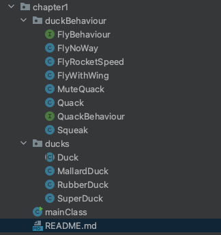

## Points for remember

- **Strategy Pattern is a _Behavioral_ pattern.**
  - It’s about **how an object behaves** dynamically by changing its algorithm or strategy at runtime.
- We **code to interfaces** — not to concrete classes.
- We **favor composition over inheritance** — because we pass the strategy object (behavior) _into_ the class at runtime, instead of subclassing for every behavior change.

# Observer Pattern

## Problem

Making a new robust weather reporting forecaster You have to make an interface or API which other developers can use and get current weather, forecast, heat-index, statistics . At later point of time we should be able to add other observable like give word summary so design must be good

And thus we use `Observer pattern`, we have a data repository which will hold all observers, now these observer get call from Observable whenever data is changed and they can do anything with that data.

Observable is centre which is master mind, and observers are dependent on observable and subscribe to changes from Observable Think it like NewPaper publisher and subscribers pattern. Observers can subscribe or unsubscribe to data-repository/Observable at anytime and while they are subscribe to the data-repository/Observable they will see the updates.

### Note

Java also provide in-built apis to use observer pattern, if u dont want to make it from scratch, but making from scratch is also easy :)

## Idea - The power of Loose Coupling

When two objects are loosely coupled, they can interact, but have very little knowledge of each other.  
The Observer Pattern provides an object design where subjects and observers are loosely coupled.

### Why?

> The only thing the subject knows about an observer is that it implements a certain interface (the Observer interface).

It doesn’t need to know the concrete class of the observer, what it does, or anything else about it.

### Point 1

> We can add new observers at any time.

Because the only thing the subject depends on is a list of objects that implement the Observer interface, we can add new  
observers whenever we want. In fact, we can replace any observer at runtime with another observer and the subject will keep purring along. Likewise, we can remove  
observers at any time

### Point 2

> We never need to modify the subject to add new types of observers.

Let’s say we have a new concrete class come along that needs to be an observer. We don’t need to make any changes to the subject to accommodate the new class type, all we have to do is implement the Observer interface in the new class and register as an observer. The subject doesn’t care; it will deliver notifications to any object that  
implements the Observer interface.

We can reuse subjects or observers independently of each other. If we  
have another use for a subject or an observer, we can easily reuse them because the  
two aren’t tightly coupled.

Changes to either the subject or an observer will not affect the other.  
Because the two are loosely coupled, we are free to make changes to either, as long as the objects still meet their obligations to implement the subject or observer interfaces.

## Implementation

```java
public interface Observable {
    void AddObserver(Observer observer);
    void RemoveObserver(Observer observer);
    void notifyObservers();
}

public interface Observer {
    void update(float temp,float humidity,float pressure);

    void unsubscribe(Observable observable);
}

public interface DisplayElement {
    public void display();
}

```

Implementation for Observable

```java
public class WeatherData implements Observable {
    ArrayList<Observer> allObservers= new ArrayList<>();
    private float temp,humidity,pressure;

    @Override
    public void AddObserver(Observer observer) {
        allObservers.add(observer);
    }

    @Override
    public void RemoveObserver(Observer observer) {
        int idx=allObservers.indexOf(observer);
        if(idx>=0){
            allObservers.remove(idx);
        }
    }

    @Override
    public void notifyObservers() {
        for(Observer observer:allObservers){
            observer.update(this.temp,this.humidity,this.pressure);
        }
    }

    public void measurementsChanged() {
        notifyObservers();
    }

    public void setMeasurements(float temp,float humidity, float pressure){
        this.temp=temp;
        this.humidity=humidity;
        this.pressure=pressure;
        measurementsChanged();
    }
}
```

Various observers like

- `CurrentConditionDisplay`
- `ForeCastPredictionsDisplay`
- `HeatIndexDisplay`
- `StatisticsDisplay`

Seeing implementation for HeatIndexDisplay, because other are trivials

```java
public class HeatIndexDisplay implements Observer,DisplayElement {
    float heatIndex = 0.0f;

    public HeatIndexDisplay(Observable observable){
        observable.AddObserver(this);
    }

    @Override
    public void display() {
        System.out.println("Heat index is " + heatIndex);
    }

    @Override
    public void update(float temp, float humidity, float pressure) {
        float t = temp;
        float rh = humidity;
        heatIndex = (float)
                (
                        (16.923 + (0.185212 * t)) +
                                (5.37941 * rh) -
                                (0.100254 * t * rh) +
                                (0.00941695 * (t * t)) +
                                (0.00728898 * (rh * rh)) +
                                (0.000345372 * (t * t * rh)) -
                                (0.000814971 * (t * rh * rh)) +
                                (0.0000102102 * (t * t * rh * rh)) -
                                (0.000038646 * (t * t * t)) +
                                (0.0000291583 * (rh * rh * rh)) +
                                (0.00000142721 * (t * t * t * rh)) +
                                (0.000000197483 * (t * rh * rh * rh)) -
                                (0.0000000218429 * (t * t * t * rh * rh)) +
                                (0.000000000843296 * (t * t * rh * rh * rh)) -
                                (0.0000000000481975 * (t * t * t * rh * rh * rh)));
        display();
    }

    @Override
    public void unsubscribe(Observable observable) {
        observable.RemoveObserver(this);
    }
}
```

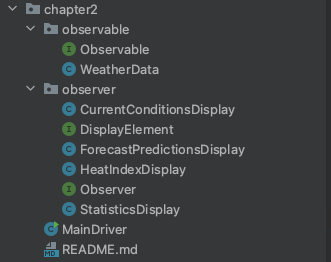

## Points to remember

- **Observer Pattern** is also a **Behavioral** pattern.
  - It defines **how objects communicate**: when one object (Subject) changes, all its dependents (Observers) are notified and updated automatically.

# Decorator Pattern

## A starbucks Problem

Modelling it into better problem as per understanding. Suppose we have paneer pizza and we can serve that pizza with topping which includes sauce, chill-powder, oregano. Now each topping has some cost associated with it and different people want different quantity. So what we can have is in simple way Pizza class which would be sub-class by different classes like paneer-pizza with oregano, paneer-pizza with chilli and oregano,......

So situation would be like 1 parent class and 300 sub-class, which is class explosion

Problem is making dishes (Tea/Coffee) with different flavour/condiments on top of it.

So is there a better way Another way is create getter and setter for powder,sauce and oregano's price in base class, and all sub-class would override the price,

- but this will lead to another problem that when price changes (like ) then we have to change price in multiple subclass class.
- New condiments will force us to add new methods and alter the cost method in the superclass.
- We may have new beverages. For some of these beverages (iced tea?), the condiments may not be appropriate, yet the Tea subclass will still inherit methods like hasWhip().
- What if a customer wants a double mocha?

This is where decorator problem comes into picture

## Idea

### Design Principle

Classes should be open for extension, but closed for modification.

Our goal is to allow classes to be easily extended to incorporate new behavior without modifying existing code.

**What do we get if we accomplish this?**
Designs that are resilient to change and fl exible enough to take on new functionality to meet changing requirements.

### Note

- While it may seem like a contradiction, there are techniques for allowing code to be extended without direct modification.
- Be careful when choosing the areas of code that need to be extended; applying the Open-Closed Principle EVERYWHERE is wasteful, unnecessary, and can lead to complex, hard to understand code.

### Some Questions

- Question - Open for extension and closed for modification? That sounds very contradictory. How can a design be both?

> That’s a very good question. It certainly sounds contradictory at first. After all, the less modifiable something is, the harder it is to extend, right? As it turns out, though, there are some clever OO techniques for allowing systems to be extended, even if we can’t change the underlying code. Think about the Observer Pattern (in Chapter 2)... by adding new Observers, we can extend the Subject at any time, without adding code to the Subject. You’ll see quite a few more ways of extending behavior with other OO design techniques.

- Question - Okay, I understand Observable,but how do I generally design something to be extensible, yet closed for modification?

> Many of the patterns give us time tested designs that protect your code from being modified by supplying a means of extension. In this chapter you’ll see a good example of using the Decorator pattern to follow the Open- Closed principle.

- For more see page number 99 of book.

### Decorator pattern in rescue

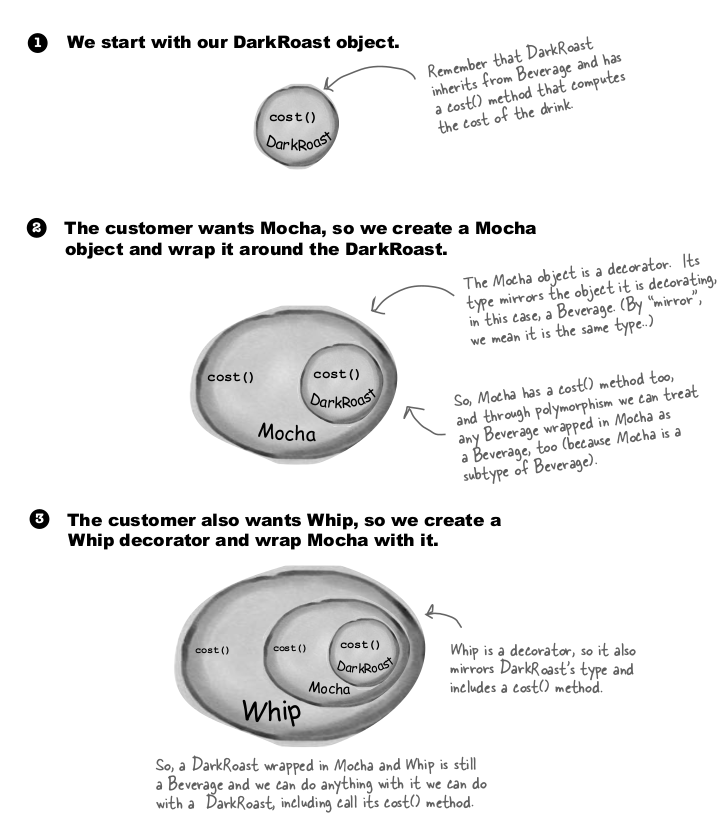
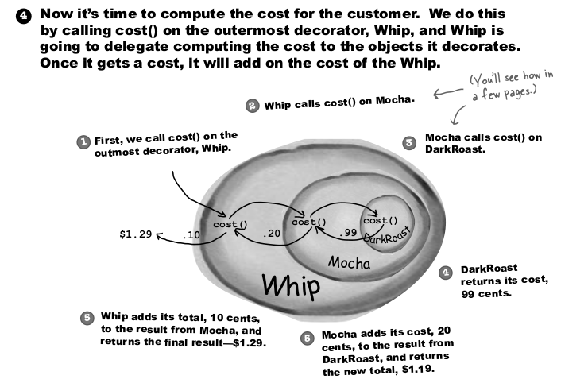

Okay, here’s what we know so far...

- Decorators have the same supertype as the objects they decorate.
- You can use one or more decorators to wrap an object.
- Given that the decorator has the same supertype as the object it decorates, we can pass around a decorated object in place of the original (wrapped) object.
- The decorator adds its own behavior either before and/or after delegating to the object it decorates to do the rest of the job.
- Objects can be decorated at any time, so we can decorate objects dynamically at runtime with as many decorators as we like.

Let’s first take a look at the Decorator Pattern description: The Decorator Pattern attaches additional responsibilities to an object dynamically. Decorators provide a flexible alternative to subclassing for extending functionality.

Problem is making dishes (Tea/Coffee) with different flavour/condiments on top of it.

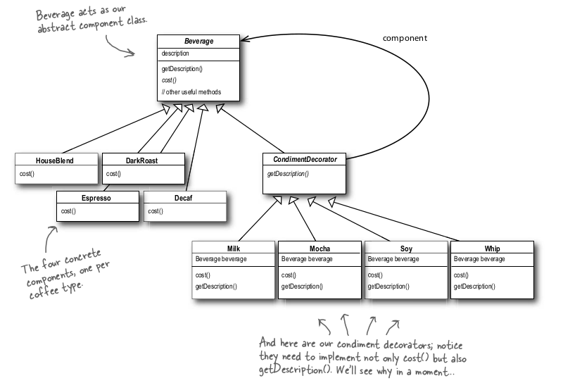

Some of the JAVA API that use decorator

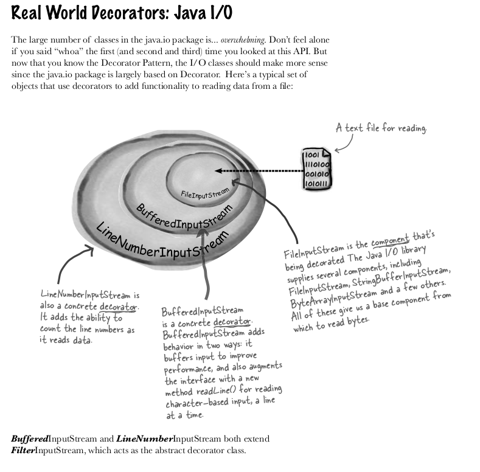

## Implementation

```java
public abstract class Beverage {
    String description="Unkown beverage";

    public String getDescription() {
        return description;
    }
    public abstract double cost();
}

public abstract class CondimentsDecorator extends Beverage {
    // First, we need le with a Beverage, interchangeab the Beverage class.
// because decorator need to be of same type it is wrapping, thus decorators are also of beverage type
	Beverage beverage;

	public abstract String getDescription();
}

```

```java
public class Espresso extends Beverage {

    public Espresso(){
        description="Expresso Coffee";
    }

    @Override
    public double cost() {
        return 1.99;
    }
}
public class HouseBlend extends Beverage {
    public HouseBlend(){
        description="House Blend coffee";
    }

    @Override
    public double cost() {
        return 0.89;
    }
}
public class Mocha extends CondimentsDecorator {

    public Mocha(Beverage beverage){
        this.beverage=beverage;
    }

    @Override
    public String getDescription() {
        return beverage.getDescription() + ", Mocha";
    }

    @Override
    public double cost() {
        return 0.20 + beverage.cost();
    }
}
public class Whip extends CondimentsDecorator{

    public Whip(Beverage beverage){
        this.beverage=beverage;
    }

    @Override
    public String getDescription() {
        return beverage.getDescription() + ", Whip";
    }

    @Override
    public double cost() {
        return  beverage.cost()+0.10;
    }
}
```

Driver function

```java
public class StarBucks {
    public static void main(String[] args) {
        Beverage beverage = new Espresso();
        System.out.println(beverage.getDescription()
                +  " $" + beverage.cost());


        // making complex beverage
        Beverage beverage1= new HouseBlend();
        // add mocha to it
        beverage1= new Mocha(beverage1);
        // add another mocha to it
        beverage1= new Mocha(beverage1);
        // add whip to ti
        beverage1= new Whip(beverage1);
        System.out.println(beverage1.getDescription()
                +  " $" + beverage1.cost());


    }
}
```

Isn't it beautiful.

### JAVA API example

```java
public class InputTest {

    public static void main(String[] args) {
        int c;
        try{
            InputStream in = new LowerCaseInputStream(new BufferedInputStream(new FileInputStream("test.txt")));
            while((c = in.read()) >= 0) {
                System.out.print((char)c);
            }
            in.close();
        }catch (IOException e){
            e.printStackTrace();
        }
    }
}

public class LowerCaseInputStream extends FilterInputStream {
    protected LowerCaseInputStream(InputStream in) {
        super(in);
    }
    public int read() throws IOException {
        int c = super.read();
        return (c == -1 ? c : Character.toLowerCase((char)c));
    }
    public int read(byte[] b, int offset, int len) throws IOException {
        int result = super.read(b, offset, len);
        for (int i = offset; i < offset + result; i++) {
            b[i] = (byte) Character.toLowerCase((char) b[i]);
        }
        return result;
    }
}

```

## Points to remember

- **Decorator Pattern** is a **Structural** pattern.
- Decorator _wraps_ the original object and extends its behavior at runtime.
- Respect Open-Closed Principle (OCP)
  - "**Software entities (classes, modules, functions) should be open for extension, but closed for modification.**"
  - Instead of **modifying** the existing class to add new features
  - You **extend** its behavior by **wrapping** it in a new decorator class.

# Factory Pattern

Get ready to bake some loosely coupled OO designs. There is more to making objects than just using the new operator. You’ll learn that instantiation is an activity that shouldn’t always be done in public and can often lead to coupling problems. And you don’t want that, do you? Find out how Factory Patterns can help save you from embarrasing dependencies.

The Factory Method Pattern defines an interface for creating an object, but lets subclasses decide which class to instantiate. Factory Method lets a class defer instantiation to subclasses.

There is a pizza company which makes different types of Pizzas, so here is the code

```java
Pizza orderPizza(String type) {
	Pizza pizza;
	if (type.equals(“cheese”)) {
		pizza = new CheesePizza();
	} else if (type.equals(“greek”) {
		pizza = new GreekPizza();
	} else if (type.equals(“pepperoni”) {
		pizza = new PepperoniPizza();
	}
	pizza.prepare();
	pizza.bake();
	pizza.cut();
	pizza.box();
	return pizza;
}
```

The above code is not closed for modification, if we want to stop producing greek pizza and add two more pizza than we need to add 6 lines and delet 3 lines in above code.

So to make orderPizza close for modification we put factory pattern

Notes

> What is benefit of this? Are not we pushing the thing to another class?

One thing to remember is that the SimplePizzaFactory may have many clients. We’ve only seen the orderPizza() method; however, there may be a PizzaShopMenu class that uses the factory to get pizzas for their current description and price. We might also have a HomeDelivery class that handles pizzas in a different way than our PizzaShop class but is also a client of the factory. So, by encapsulating the pizza creating in one class, we now have only one place to make modifications when the implementation changes.Don’t forget, we are also just about to remove the concrete instantiations from our client code!

Below is the sample implementation

```java
Pizza orderPizza(String type) {
	Pizza pizza=factory.ceratePizza(type);
	pizza.prepare();
	pizza.bake();
	pizza.cut();
	pizza.box();
	return pizza;
}
public class SimplePizzaFactory {
	Pizza pizza = null;
	if (type.equals(“cheese”)) {
		pizza = new CheesePizza();
	} else if (type.equals(“pepperoni”)) {
		pizza = new PepperoniPizza();
	} else if (type.equals(“clam”)) {
		pizza = new ClamPizza();
	} else if (type.equals(“veggie”)) {
		pizza = new VeggiePizza();
	}
	return pizza;
}
```

Now suppose we want to go one step ahead and we are expanding and we have franchise all around.

Summarising things till now

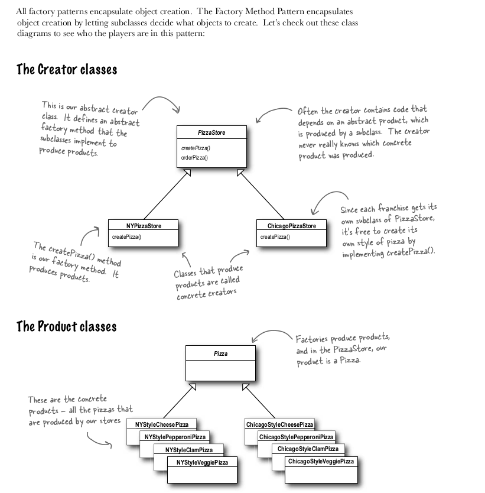

The Factory Method Pattern defines an interface for creating an object, but lets subclasses decide which class to instantiate. Factory Method lets a class defer instantiation to subclasses.

## Problem

We did everything well but some franchises used bad quality ingredients to minimize the cost, so we want to stop that, the one way to stop them is using our own factory that make quality products and ship them to these franchises. So we create Ingredients factory for each franchise, so that they can get quality ingredients from there without affection our brand-value.

This would create factory for all ingredients

> The Abstract Factory Pattern provides an interface for creating families of related or dependent objects without specifying their concrete classes.

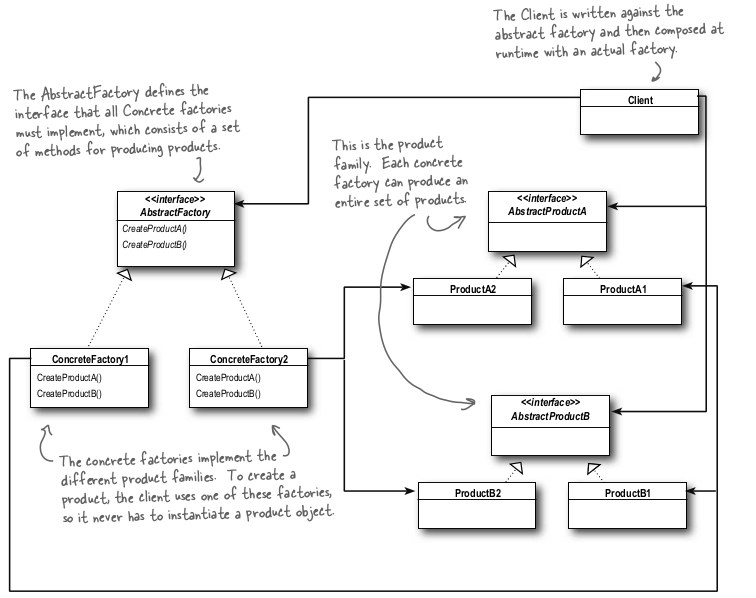

Lets see what was this in our case:
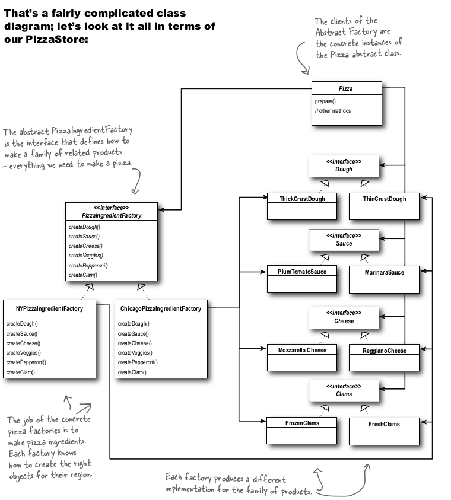

## Implementation

Above diagram looks too much to implement, but its easy peasy

### Define all ingredients

These are all defined in terms of interfaces like below

```java
public class Utils {
    public interface Dough{

    }
    public interface Sauce {

    }
    public interface Cheese {

    }
    public interface Veggies{

    }
    public interface Pepperoni {

    }
    public interface Clams {

    }
    public static class ThinCrustDough implements Dough{

    }
    public static class ThickCrustDough implements Dough{

    }
    public static class MarinaraSauce implements Sauce{

    }
    public static class PlumeTomatoSauce implements Sauce{

    }
    public static class ReggianoCheese implements Cheese{

    }
    public static class Mozzarella implements Cheese{

    }

    public static class EggPlant implements Veggies{}
    public static class BlackOliver implements Veggies{}
    public static class Spinach implements Veggies{}

    public static class Garlic implements Veggies{}

    public static class Onion implements Veggies{}

    public static class Mushroom implements Veggies{}

    public static class RedPepper implements Veggies{}

    public static class SlicedPepperoni implements Pepperoni{}

    public static class FreshClams implements Clams{}
    public static class FrozenClams implements Clams{}

}
```

### Define Factories

An interface and its implementation like Chicago or New York

```java
public interface PizzaIngredientFactory {
    public Utils.Dough createDough();
    public Utils.Sauce createSauce();
    public Utils.Cheese createCheese();
    public Utils.Veggies[] createVeggies();
    public Utils.Pepperoni createPepperoni();
    public Utils.Clams createClam();
}

public class NYPizzaIngredientFactory implements PizzaIngredientFactory {
    @Override
    public Utils.Dough createDough() {
        return new Utils.ThinCrustDough();
    }

    @Override
    public Utils.Sauce createSauce() {
        return new Utils.MarinaraSauce();
    }

    @Override
    public Utils.Cheese createCheese() {
        return new Utils.ReggianoCheese();
    }

    @Override
    public Utils.Veggies[] createVeggies() {
        Utils.Veggies veggies[] = { new Utils.Garlic(), new Utils.Onion(), new Utils.Mushroom(), new Utils.RedPepper() };
        return veggies;
    }

    @Override
    public Utils.Pepperoni createPepperoni() {
        return new Utils.SlicedPepperoni();
    }

    @Override
    public Utils.Clams createClam() {
        return new Utils.FreshClams();
    }
}

public class ChicagoIngredientFactory implements PizzaIngredientFactory {
    @Override
    public Utils.Dough createDough() {
        return new Utils.ThickCrustDough();
    }

    @Override
    public Utils.Sauce createSauce() {
        return new Utils.PlumeTomatoSauce();
    }

    @Override
    public Utils.Cheese createCheese() {
        return new Utils.Mozzarella();
    }

    @Override
    public Utils.Veggies[] createVeggies() {
        Utils.Veggies veggies[] = { new Utils.Spinach(), new Utils.BlackOliver(), new Utils.EggPlant()};
        return veggies;
    }

    @Override
    public Utils.Pepperoni createPepperoni() {
        return new Utils.SlicedPepperoni();
    }

    @Override
    public Utils.Clams createClam() {
        return new Utils.FrozenClams();
    }
}

```

### Let's define pizzas

```java
public abstract class Pizza {
    String name;
    Utils.Dough dough;
    Utils.Sauce sauce;
    Utils.Cheese cheese;

    public Utils.Veggies veggies[];

    public ArrayList<String> toppings= new ArrayList<>();

    // making prepare abstract
    public abstract void prepare();

    public void bake(){
        System.out.println("Bake for 25 mins at 350 temperature");
    }

    public void cut() {
        System.out.println("Cutting the pizza into diagonal slices");
    }
    public void box() {
        System.out.println("Place pizza in official PizzaStore box");
    }

    public String getName() {
        return name;
    }

    @Override
    public String toString() {
        return "pizza name is :"+name;
    }
}
```

Now Different class would implement this

- ChicagoStyleCheesePizza
- ChicagoStyleVeggiePizza
- NYStyleCheesePizza
- NYStyleVeggiePizza

each Pizza would get its ingredients like dough, sauce, cheese from factory

sample code for `NYStyleVeggiePizza` is below

```java
public class NYStyleVeggiePizza extends Pizza {
    PizzaIngredientFactory ingredientFactory;

    public NYStyleVeggiePizza(PizzaIngredientFactory pizzaIngredientFactory){
        this.ingredientFactory=pizzaIngredientFactory;
    }

    @Override
    public void prepare() {
        name="Chicago Style Deep Dish Cheese Pizza";
        /*dough="Extra Thick Crust Dough";
        sauce="Plum Tomato Sauce";*/           dough=ingredientFactory.createDough();
        sauce=ingredientFactory.createSauce();
        cheese=ingredientFactory.createCheese();
//        toppings.add("Shredded Mozzarella Cheese");
    }

    @Override
    public void cut() {
        System.out.println("Cutting the pizza into square slices");
    }
}
```

### Let's create Store

An interface for stores

```java
public abstract class PizzaStore {
    public Pizza orderPizza(String type){
        Pizza pizza;
        pizza= createPizza(type);

        pizza.prepare();
        pizza.bake();
        pizza.cut();
        pizza.box();

        return pizza;
    }

    abstract Pizza createPizza(String type);
}
```

we would be having implementation for this

- ChicagoPizzaStore
- NYPizzaStore

An implementation code for NYPizzaStore is following

```java
public class NYPizzaStore extends PizzaStore {
    @Override
    Pizza createPizza(String type) {
        NYPizzaIngredientFactory ingredientFactory =
                new NYPizzaIngredientFactory();
        if (type.equals("cheese")) {
            return new NYStyleCheesePizza(ingredientFactory);
        } else if (type.equals("veggie")) {
            return new NYStyleVeggiePizza(ingredientFactory);
        } else return null;
    }
}
```

Finally driver class

```java
public class FoodOrderClass {
    public static void main(String[] args) {
        PizzaStore nyPizzaStore =new NYPizzaStore();
        PizzaStore chicagoPizzaStore= new ChicagoPizzaStore();

        Pizza pizza= nyPizzaStore.orderPizza("cheese");
        System.out.println("Pizza ordered by nitin :"+pizza.getName()+"\n");

        pizza= chicagoPizzaStore.orderPizza("cheese");
        System.out.println("Pizza ordered by nikhil :"+pizza.getName()+"\n");
    }
}
```

## Things to remember

- **Factory Pattern** is a **Creational** pattern.
  - It **abstracts and controls the object creation process**, so the client code does not directly instantiate classes using `new`.
- Problem it solves
  - If your client code (`main()`, UI layer, etc.) **directly uses `new` to create objects**, then
  - It gets tightly coupled to **concrete classes**.
  - If tomorrow, you need to change which class to instantiate, you have to modify client code everywhere.
  - It's harder to control and manage object creation logic (e.g., selecting a class based on a condition).
- Solution it offers
  - Hiding the **instantiation logic** inside a Factory.
  - Client **asks** the Factory for an object, without worrying about `new`.
  - Easy to swap, configure, or extend products later.

# Singleton Pattern

The Singleton Pattern ensures a class has only one instance, and provides a global point of access to it.

## Initialisation type

| Aspect        | Eager Initialization                                         | Lazy Initialization                                 |
| ------------- | ------------------------------------------------------------ | --------------------------------------------------- |
| When created  | Immediately at class loading time                            | Only when needed (first request)                    |
| Memory usage  | Might waste memory if never used                             | Efficient memory usage                              |
| Example       | `private static final Singleton instance = new Singleton();` | `if (instance == null) instance = new Singleton();` |
| Thread Safety | Safer (because JVM loads it once)                            | Needs extra handling for thread safety              |

## Eager Example

```java
public class EagerSingleton {
    private static final EagerSingleton instance = new EagerSingleton(); // created at load time

    private EagerSingleton() { }

    public static EagerSingleton getInstance() {
        return instance;
    }
}

```

## Lazy Example

```java
public class LazySingleton {
    private static LazySingleton instance; // NOT initialized immediately

    private LazySingleton() { } // private constructor

    public static LazySingleton getInstance() {
        if (instance == null) {
            instance = new LazySingleton(); // create only when needed
        }
        return instance;
    }
}

```

### Making Lazy Thread Safe

#### Using synchronized keyword

```java
public class LazySingleton {
    private static LazySingleton instance;

    private LazySingleton() { }

    public static synchronized LazySingleton getInstance() {
        if (instance == null) {
            instance = new LazySingleton();
        }
        return instance;
    }
}
```

its thread safe, but syncronised every time even after instance is created, its a performance hit

#### **Double-Checked Locking (DCL)** (optimized)

```java
public class DoubleCheckedLockingSingleton {
    private static volatile DoubleCheckedLockingSingleton instance;

    private DoubleCheckedLockingSingleton() { }

    public static DoubleCheckedLockingSingleton getInstance() {
        if (instance == null) { // 1st check (no locking)
            synchronized (DoubleCheckedLockingSingleton.class) {
                if (instance == null) { // 2nd check (with locking)
                    instance = new DoubleCheckedLockingSingleton();
                }
            }
        }
        return instance;
    }
}

```

Efficient + First Time lock only + `volatile` is **critical** to avoid instruction reordering problems.

#### Bill Pugh Singleton (best and cleanest)

```java
public class BillPughSingleton {
    private BillPughSingleton() { }

    private static class Holder {
        private static final BillPughSingleton INSTANCE = new BillPughSingleton();
    }

    public static BillPughSingleton getInstance() {
        return Holder.INSTANCE;
    }
}

```

No need of `synchronized`. + JVM loads `Holder` class **only when** `getInstance()` is called. + **Lazy** + **Thread-safe** naturally by Java's classloader behavior.

| Case                                                            | Prefer                                                 |
| --------------------------------------------------------------- | ------------------------------------------------------ |
| If instance is lightweight and ALWAYS needed at app start       | **Eager**                                              |
| If instance creation is heavy (DB connections, file read, etc.) | **Lazy**                                               |
| If startup time matters (e.g., mobile apps)                     | **Lazy**                                               |
| If multithreading complications must be avoided easily          | **Eager** (because JVM creates it safely at load time) |
| If object is optional (only certain flows use it)               | **Lazy**                                               |

- **Critical objects** (that are always needed) → **Eager**

- **Optional/heavy objects** (that may never be used) → **Lazy**

**Quick example:**

- ConfigManager / LoggingSystem → Eager

- DBConnectionManager / CacheLoader → Lazy

## Dont use singleton much

- **Hidden dependencies** → classes secretly access singleton without constructor injection.
- **Tight coupling** → hard to replace or mock singleton in unit tests.
- **Global mutable state** → different parts of app can unpredictably modify shared singleton.
- **Difficult testing** → singleton retains state between tests causing flaky tests.
- **Bad scalability** → singleton only lives per JVM; not shared across multiple servers.
- **Thread safety issues** → if lazy singleton is incorrectly implemented (missing `volatile`, bad locking).
- **Overuse** → developers use singleton even when not necessary, making design rigid.
- **Violation of Single Responsibility Principle** → singleton often grows bloated doing too much over time.

# Command Pattern

You are asked to implement a home automation API for a remote which has 7 slots and each slot has 'on' and 'off' button for each appliance, and we have a undo button also in the remote, which undos the last command.

You can see we have following remote

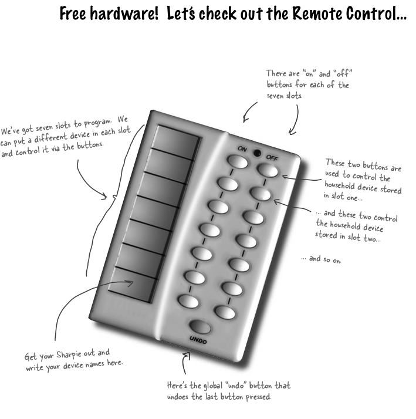

And we have following implementation by vendors
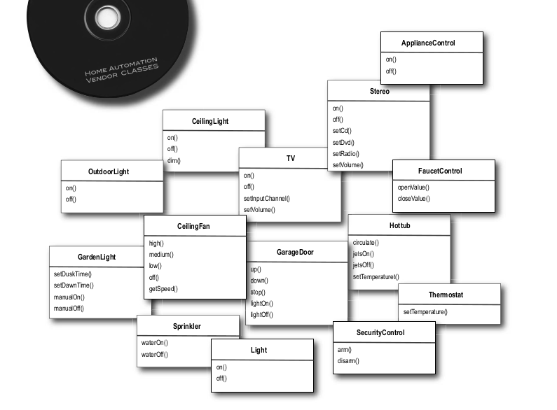

We have a fan which can be made high and low, we have garage door and we have different appliances on which different operations can be performed.

## Implementation

If looking at from 1st principle its nothing but this implementation is very naive and easy to come up with.

```java
public abstract class Appliance {
    public String name;
}

public class CeilingFan extends Appliance{
    int fanSpeed=0;

    public void on(){
        System.out.println(name+"'s fan is on!");
    }

    public void off(){
        System.out.println(name+"'s fan is off!");
    }

    public void increaseFanSpeed(){
        if(fanSpeed<3){
            System.out.println("Increasing fan speed....");
            fanSpeed++;
        }else
            System.out.println("Cannot increase fan speed, already working with full speed");
    }

    public int getFanSpeed() {
        return fanSpeed;
    }

    public CeilingFan(String name){
        this.name=name;
    }
}

public class GarageDoor extends Appliance {...}

public class Light extends Appliance{ ... }

public class Stereo extends Appliance {

```

And then command interface and its implementations

```java
public interface Command {
    void execute();
    void undo();
}

public class CeilingFanOffCommand implements Command {
    CeilingFan fan;

    public CeilingFanOffCommand(CeilingFan fan){
        this.fan=fan;
    }

    @Override
    public void execute() {
        fan.off();
    }

    @Override
    public void undo() {
        fan.on();
    }
}
public class CeilingFanOnCommand implements Command {...}
public class GarageDoorCloseCommand implements Command {...}
....
// see below SS for more implementations
```

Setting up home remote

```java
public class HomeAutomationRemote {
    Command lastCommand;
    Command[] onCommands;
    Command[] offCommands;
    public HomeAutomationRemote(){
        onCommands= new Command[7];
        offCommands= new Command[7];

        Command noCommand=new NoCommand();
        for(int i=0;i<7;i++){
            onCommands[i]=noCommand;
            offCommands[i]=noCommand;
        }
        lastCommand=noCommand;
    }

    public void setCommand(Command onCommand,Command offCommand,int idx){
        onCommands[idx]=onCommand;
        offCommands[idx]=offCommand;
    }

    public void onButtonWasPressed(int idx){
        System.out.println();
        onCommands[idx].execute();
        lastCommand=onCommands[idx];
    }

    public void offButtonPressed(int idx){
        System.out.println();
        offCommands[idx].execute();
        lastCommand=offCommands[idx];
    }

    public void undoButtonPressed(){
        System.out.println("Undo button is pressed ............ ");
        lastCommand.undo();
    }

    public String toString() {
        StringBuilder stringBuff = new StringBuilder();
        stringBuff.append("\n------ Remote Control -------\n");
        for (int i = 0; i < onCommands.length; i++) {
            stringBuff.append("[slot " + i + "]"  + onCommands[i].getClass().getName() + "" + offCommands[i].getClass().getName() + "\n");
        }
        return stringBuff.toString();
    }
}
```

And then finally main driver class

```java
public class HomeAutomationDriver {
    public static void main(String[] args) {
        HomeAutomationRemote homeAutomationRemote= new HomeAutomationRemote();

        // dinning room 's light
        Light light= new Light("Dinning Room Light");
        Command lightOnCommand= new LightOnCommand(light);
        Command lightOffCommand = new LightOffCommand(light);
        homeAutomationRemote.setCommand(lightOnCommand,lightOffCommand,0);

        //kitchen room's light
        Light lightKitchen= new Light("Kitchen Room Light");
        Command lightOnCommand2= new LightOnCommand(lightKitchen);
        Command lightOffCommand2 = new LightOffCommand(lightKitchen);
        homeAutomationRemote.setCommand(lightOnCommand2,lightOffCommand2,1);

        //ceiling fan
        CeilingFan ceilingFan= new CeilingFan("Dining Ceiling fan");
        Command fanOnCommand= new CeilingFanOnCommand(ceilingFan);
        Command fanOffCommand= new CeilingFanOffCommand(ceilingFan);
        homeAutomationRemote.setCommand(fanOnCommand,fanOffCommand,2);

        //garage
        Light garageLight = new Light("Garage Light");
        GarageDoor garageDoor= new GarageDoor("Audi Garage",garageLight);
        Command garageOpen = new GarageDoorOpenCommand(garageDoor);
        Command garageClose = new GarageDoorCloseCommand(garageDoor);
        homeAutomationRemote.setCommand(garageOpen,garageClose,3);

        //stereo later
        // its okay

        System.out.println("Remote is "+homeAutomationRemote);
        homeAutomationRemote.onButtonWasPressed(0);
        homeAutomationRemote.onButtonWasPressed(1);
        homeAutomationRemote.undoButtonPressed();
        homeAutomationRemote.onButtonWasPressed(1);
        homeAutomationRemote.onButtonWasPressed(2);
        homeAutomationRemote.onButtonWasPressed(3);

        homeAutomationRemote.offButtonPressed(0);
        homeAutomationRemote.offButtonPressed(3);
        homeAutomationRemote.offButtonPressed(2);
    }
}
```

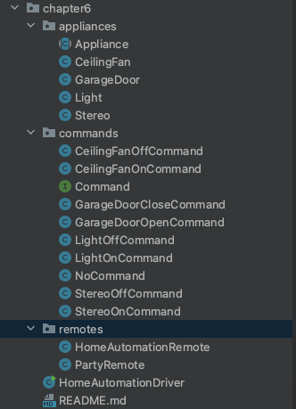

See next part
