# Intro

> This is a summary of Book [Head First Design Pattern by Oreilly](https://www.oreilly.com/library/view/head-first-design/0596007124/). This is a futile attempt to summarise the book. True Software enthusiast must read the book. You will fall in love with designing softwares.

I am just writing this article as a note for myself here.

Part One is [here](https://dalakoti07.in/posts/engineering-design-pattern-part-1/)

# Adapter Pattern

The Adapter Pattern converts the interface of a class into another interface the clients expect. Adapter lets classes work together that couldn’t otherwise because of incompatible interfaces.

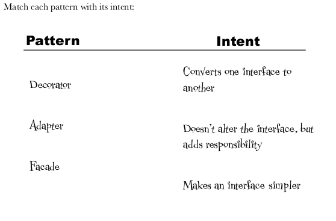

Answer is

- Decorator is for adding responsibilities
- adapter is for converting one interface to another
- facade is for making interface simpler

## Example

```java
public interface Duck {
    public void quack();
    public void fly();
}
public interface Turkey {
    public void gobble();
    public void fly();
}
public class WildTurkey implements Turkey {...}
public class MallardDuck implements Duck { ... }
```

Then an adapter which takes in turkey and make it do actions like a duck does

```java
public class TurkeyAdapter implements Duck {
    Turkey turkey;

    public TurkeyAdapter(Turkey turkey){
        this.turkey=turkey;
    }

    @Override
    public void quack() {
        turkey.gobble();
    }

    @Override
    public void fly() {
        for(int i=0;i<5;i++)
            turkey.fly();
    }
}
```

```java
public class DuckTestDrive {
    public static void main(String[] args) {
        MallardDuck mallardDuck= new MallardDuck();

        WildTurkey wildTurkey= new WildTurkey();
        Duck turkeyAdapter= new TurkeyAdapter(wildTurkey);

        System.out.println("The turkey says ...");
        wildTurkey.gobble();
        wildTurkey.fly();

        System.out.println("The duck says");
        trigeerTheDuck(mallardDuck);

        System.out.println("The adapter duck says(I am turkey in disguise of duck ) says");
        trigeerTheDuck(turkeyAdapter);
    }

    private static void trigeerTheDuck(Duck duck) {
        duck.quack();
        duck.fly();
    }
}
```

## Points to remember

- Problem is solves
  - Two classes cannot work together because their **interfaces don’t match**.
- Structural Pattern
  - Because it **connects two incompatible interfaces** together without changing their existing code.

# Facade Pattern

Facade is simple, very intiutive.

The Facade Pattern provides a unified interface to a set of interfaces in a subsytem. Facade defines a higher- level interface that makes the subsystem easier to use.

## Problem : Making a home theater

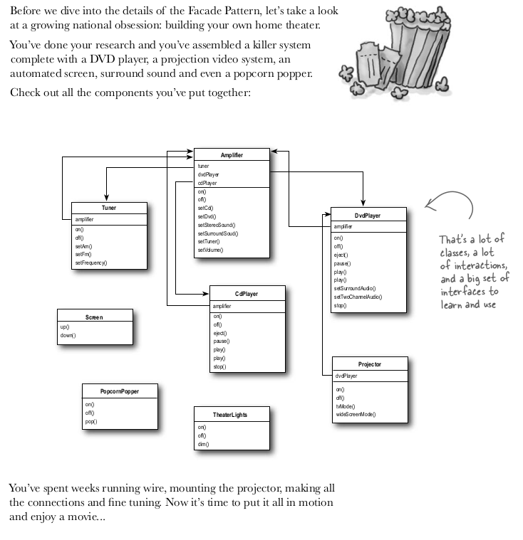
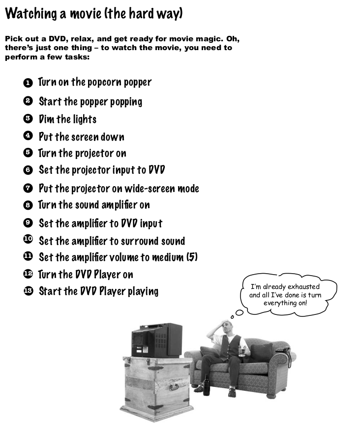
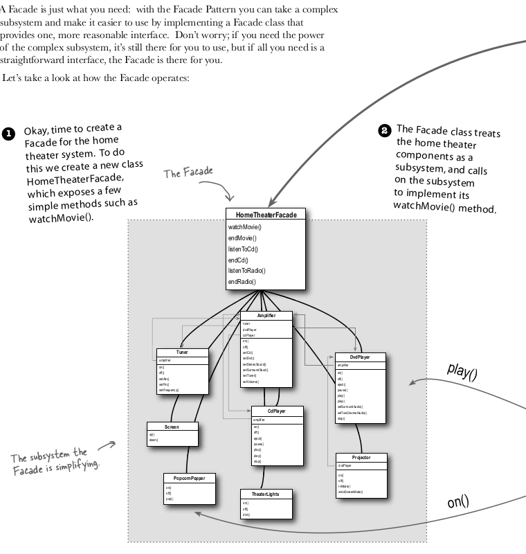

## Implementation

```java
public class CollectiveDependency {

    public static class Amplifier{
        void on(){
            System.out.println("Amp is on !");
        }
        void off(){
            System.out.println("App is off");
        }
        void setDVD(DVD dvd){
            System.out.println("Setting the dvd");
        }
        void setSurroundingSound(){
            System.out.println("Setting surrounding sound");
        }
        void setVolume(){
            System.out.println("Setting the volume ");
        }
    }

    public static class DVD{

    }

    public static class Tuner{}

    public static class CDPlayer{
        void on(){
            System.out.println("Making cd player on...");
        }
        void off(){
            System.out.println("Making cd player off ...");
        }
        void playMovie(String movie){
            System.out.println("Playing movie "+movie+" in cd player");
        }
        void stop(){
            System.out.println("DVD stopped");
        }
        void eject(){
            System.out.println("DVD is ejected ");
        }
    }

    public static class Projector{
        void projectorOn(){
            System.out.println("Making projector on");
        }
        void projectorWideScreen(){
            System.out.println("Making projector wide screen");
        }
        void projectorOff(){
            System.out.println("Making projector off");
        }
    }

    public static class TheaterLights{
        void lightsDim(){
            System.out.println("Dimming the lights");
        }
        void lightsOn(){
            System.out.println("Making lights on");
        }
    }

    public static class Screen{
        void screenUp(){
            System.out.println("Making screen up");
        }
        void screenDown(){
            System.out.println("Making screen down");
        }
    }

    public static class PopCornPopper{
        void on(){
            System.out.println("Popper is on !");
        }
        void pop(){
            System.out.println("Popper is popping popcorns !");
        }
        void off(){
            System.out.println("Making popper off");
        }
    }
}
```

The facade would take in all the dependencies and then do the work

```java
public class HomeTheaterFacade {
    CollectiveDependency.Amplifier amp;
    CollectiveDependency.Tuner tuner;
    CollectiveDependency.DVD dvd;
    CollectiveDependency.CDPlayer cd;
    CollectiveDependency.Projector projector;
    CollectiveDependency.TheaterLights lights;
    CollectiveDependency.Screen screen;
    CollectiveDependency.PopCornPopper popper;


    public HomeTheaterFacade(CollectiveDependency.Amplifier amplifier,
                             CollectiveDependency.Tuner tuner, CollectiveDependency.DVD dvd,
                             CollectiveDependency.Projector projector, CollectiveDependency.Screen screen,
                             CollectiveDependency.TheaterLights lights, CollectiveDependency.PopCornPopper popper, CollectiveDependency.CDPlayer cdPlayer){
        this.amp=amplifier;
        this.tuner=tuner;
        this.dvd=dvd;
        this.projector=projector;
        this.screen=screen;
        this.lights=lights;
        this.popper=popper;
        this.cd=cdPlayer;
    }

    public void watchMovie(String movie) {
        System.out.println("Watch a movie ");
        popper.on();
        popper.pop();
        lights.lightsDim();
        screen.screenDown();
        projector.projectorOn();
        projector.projectorWideScreen();
        amp.on();
        amp.setDVD(dvd);
        amp.setSurroundingSound();
        amp.setVolume();
        cd.on();
        cd.playMovie(movie);
    }

    public void EndMovie(){
        System.out.println("Ending the movie");
        popper.off();
        lights.lightsOn();
        screen.screenUp();
        projector.projectorOff();
        amp.off();
        cd.stop();
        cd.eject();
        cd.off();
    }
}
```

the main driver function

```java
public class HomeTheaterTestDrive {

    public static void main(String[] args) throws InterruptedException {
        HomeTheaterFacade homeTheater= new HomeTheaterFacade(new CollectiveDependency.Amplifier(),new CollectiveDependency.Tuner(),
                new CollectiveDependency.DVD(),new CollectiveDependency.Projector(),new CollectiveDependency.Screen(),
                new CollectiveDependency.TheaterLights(),new CollectiveDependency.PopCornPopper(),new CollectiveDependency.CDPlayer());
        homeTheater.watchMovie("Twilight");
        System.out.println("Watching twilight....");
        Thread.sleep(2000);
        homeTheater.EndMovie();
    }
}
```

## Points to remember

- Facade is **Structural** Pattern
- Problem is solves
  - When a system has **too many classes/subsystems** with **complicated interactions**, it becomes hard for the client to use it properly and cleanly.
  - Solution
    - Hiding the **complexity** behind a simple API.
    - Providing a **single unified entry point** to interact with multiple subsystems.

Client → Facade → Subsystems

Example

- Want to watch a movie at home
- Turn on the TV, the sound system, set the lights, select HDMI input... ❌ Tedious!
- homeTheaterFacade.watchMovie();
  - Internally, it starts TV, dims lights, selects source, etc.

| Aspect        | Facade                                                                 | Adapter                                                           |
| ------------- | ---------------------------------------------------------------------- | ----------------------------------------------------------------- |
| Purpose       | **Simplifies** a complex subsystem by providing a high-level interface | **Bridges** two incompatible interfaces so they can work together |
| Focus         | **Ease of use** for the client                                         | **Compatibility** between mismatched interfaces                   |
| Changes APIs? | **Does NOT change** subsystem interfaces internally                    | **Adapts** one interface into another                             |
| Example       | `HomeTheaterFacade.watchMovie()` simplifies starting 5 systems         | `SquarePegAdapter` allows `SquarePeg` to fit in `RoundHole`       |

# Template Pattern

## Problem

Lets make some beverages to drink, tea and coffee. Here are steps for making them

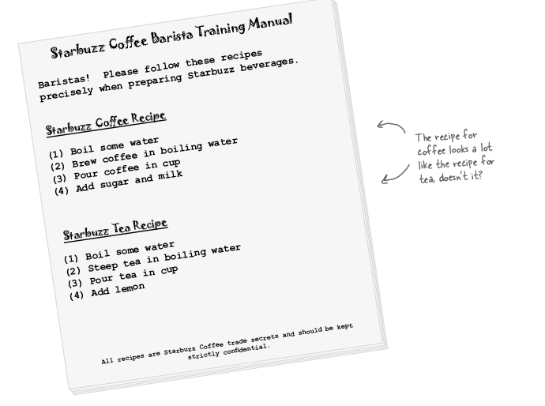

We can see there are some steps common and we can encapsute these common in base class let other subclass changes the changing algo.
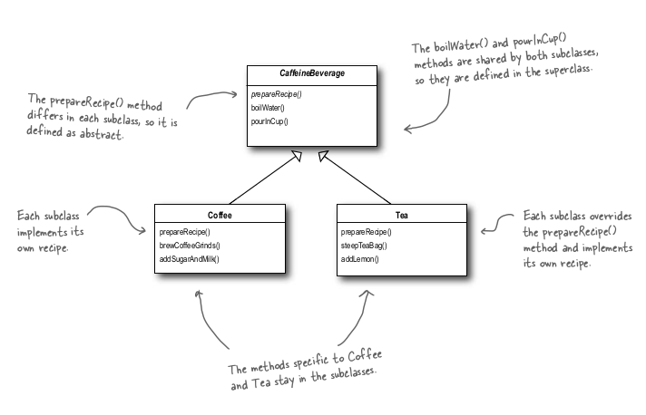
But we can also further abstract the methods. Like see below
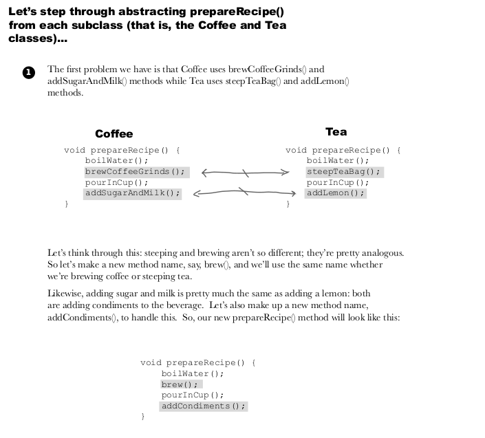

## Idea

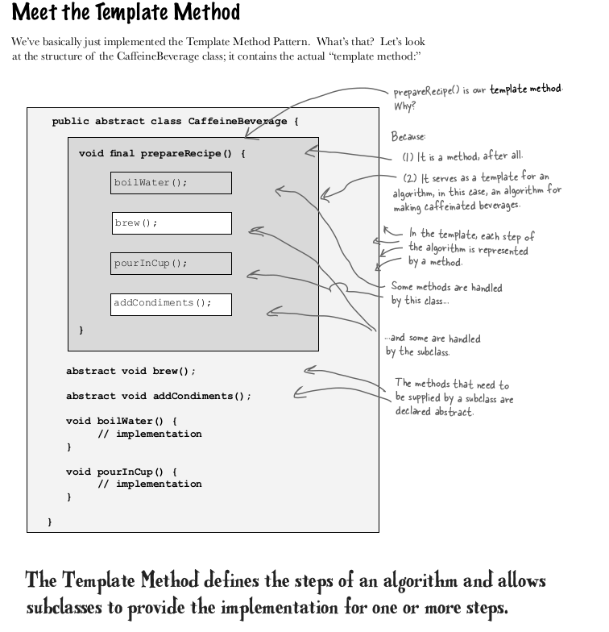

The Template Method Pattern defines the skeleton of an algorithm in a method, deferring some steps to  
subclasses. Template Method lets subclasses redefine certain steps of an algorithm without changing the algorithm’s structure.

This pattern is all about creating a template for an algorithm. What’s a template?  
As you’ve seen it’s just a method; more specifically, it’s a method that defines an  
algorithm as a set of steps. One or more of these steps is defined to be abstract and  
implemented by a subclass. This ensures the algorithm’s structure stays unchanged,  
while subclasses provide some part of the implementation.

### Hooks

Hooks are method which in super class and sub-class have choice to implement them or not.

### Hollywood Principle

Don’t call us, we’ll call you

This principle avoid cyclic dependency between high-level component and low level components.

How does the Hollywood Principle relate to the Dependency Inversion Principle that we learned a few chapters back?

> The Dependency Inversion Principle teaches us to avoid the use of concrete classes and instead work as much as possible with abstractions. The Hollywood Principle is a technique for building frameworks or components so that lower-level components can be hooked into the computation, but without creating dependencies between the lower-level components and the higher-level layers. So, they both have the goal of decoupling, but the Dependency Inversion Principle makes a much stronger and general statement about how to avoid dependencies in design. The Hollywood Principle gives us a technique for creating designs that allow low-level structures to interoperate while preventing other classes from becoming too dependent on them.

Is a low-level component disallowed from calling a method in a higher-level component?

> Not really. In fact, a low level component will often end up calling a method defined above it in the inheritance hierarchy purely through inheritance. But we want to avoid creating explicit circular dependencies between the low-level component and the high-level ones.```

## A Flashback

Template - subclass decides how to implement steps in algo  
Strategy - Encapsulate full interchangable algo / behaviour and use delegation to decide which behaviour to use  
Factory - let subclass decide how to create concrete class.

## Implementation

A skeleton Interface

```java
public abstract class CaffeineBeverage {
    final void prepareRecipe() {
        boilWater();
        brew();
        pourInCup();
        if (customerWantsCondiments()) {
            addCondiments();
        }
    }
    abstract void brew();
    abstract void addCondiments();
    void boilWater() {
        System.out.println("Boiling water");
    }
    void pourInCup() {
        System.out.println("Pouring into cup");
    }
    boolean customerWantsCondiments() {
        return true;
    }
}
```

Coffee and Tea would implement

Coffee implementation is

```java
public class Coffee extends CaffeineBeverage {
    @Override
    void brew() {
        System.out.println("Dripping Coffee through filter");
    }

    @Override
    void addCondiments() {
        System.out.println("Adding Sugar and Milk");
    }

    public boolean customerWantsCondiments() {
        String answer = getUserInput();
        if (answer.toLowerCase().startsWith("y")) {
            return true;
        } else {
            return false;
        }
    }

    private String getUserInput() {
        System.out.print("Would you like milk and sugar with your coffee (y/n)? ");
        String answer=null;
        BufferedReader in = new BufferedReader(new InputStreamReader(System.in));
        try {
            answer = in.readLine();
        } catch (IOException ioe) {
            System.err.println("IO error trying to read your answer");
        }
        System.out.println("Read "+answer+" from user");
        if(answer==null)
            return "no";
        return answer;
    }
}
```

Driver Class is following

```java
public class DrinkBeverage {
    public static void main(String[] args) {
        Coffee coffee= new Coffee();
        System.out.println("Preparing coffee .....");
        coffee.prepareRecipe();

        Tea tea= new Tea();
        System.out.println("Preparing tea .......");
        tea.prepareRecipe();
    }
}
```

## Things to remember

- Overriding toComp() in custom object when sorting that type of array using Java Array.Sort() , is an example of Template pattern, providing toCompare() is called an example.
- In strategy pattern we have sub-class implementing full algo, but in template pattern we let subclass implement a sub-part to algo.
- Its is a behaviour Pattern
  - Because it defines the **skeleton of an algorithm**, and **lets subclasses change specific steps** of that algorithm without changing its overall structure.|

# Iterator Pattern

The Iterator Pattern provides a way to access the elements of an aggregate object sequentially without exposing its underlying representation.

## Problem

We have two list dinner-list and lunch-list provider class, but the problem is that both use different approach, one use arraylist and one use array, and they both have bunch of arrayList and array's functionality which work on arraylist and array. Now we want a central class which would query lunch and dinner list and show it. One way to achieve this is as follows
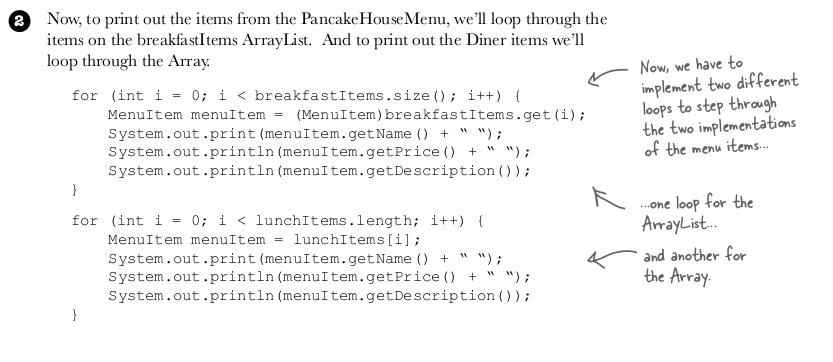

If there are 3 list, then 3 loops?

Is there a better way?

A better way is to let both of them implement iterator interface and it would make it much easier
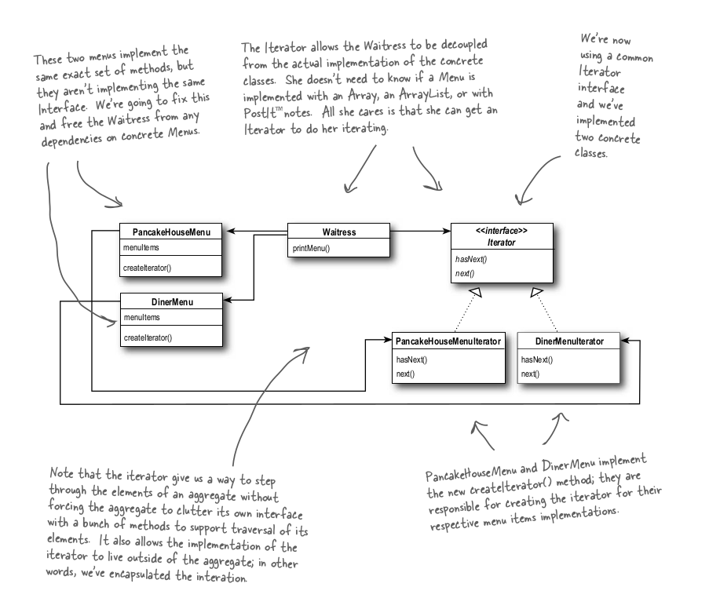

## Implementation

- We have Menu Item class
- Dinner Menu
  - has some items
  - list of items
- Pancake Menu
  - has some items
  - implemented via array list
- Create iterators
  - for Dinner Menu called DinnerMenuIterator which extends Iterator in Java API
  - for Pancake Menu
    - not needed as its array list by default

```java
public class DinnerMenu {
    static final int MAX_ITEMS = 6;
    int numberOfItems = 0;
    MenuItem[] menuItems;

    public DinnerMenu(){
        menuItems = new MenuItem[MAX_ITEMS];
        addItem("Vegetarian BLT ","Falcon with tomato",true,2.99);
        addItem("Vegetarian BLT 2 ","Falcon with onion",true,2.99);
        addItem("Vegetarian BLT 3","Falcon with carrots",true,2.99);
        addItem("Hot Dog ","Topped with tomato, onion and cheeses",false,2.99);
    }

    public void addItem(String name, String description, boolean vegetarian, double price) {
        MenuItem menuItem = new MenuItem(name, description, vegetarian, price);
        if (numberOfItems >= MAX_ITEMS) {
            System.err.println("Sorry, menu is full! Can’t add item to menu");
        } else {
            menuItems[numberOfItems] = menuItem;
            numberOfItems = numberOfItems + 1;
        }
    }

    public Iterator createIterator() {
        return new DinnerMenuIterator(menuItems);
    }
    //other methods here
}

public class DinnerMenuIterator implements Iterator {

    MenuItem[] items;
    int position = 0;

    public DinnerMenuIterator(MenuItem[] items) {
        this.items = items;
    }

    @Override
    public void remove() {

    }

    @Override
    public boolean hasNext() {
        if (position >= items.length || items[position] == null) {
            return false;
        } else {
            return true;
        }
    }

    @Override
    public Object next() {
        MenuItem menuItem = items[position];
        position = position + 1;
        return menuItem;
    }
}

```

```java
public class PancakeHouseMenu {

    ArrayList<MenuItem> menuItems;

    public PancakeHouseMenu(){
        menuItems= new ArrayList<>();
        addItem("A & B's Pancake Breakfast","Pancake with eggs and toast",true,2.99);
        addItem("Regular Pancake Breakfast","Pancake with eggs and sausages",false,3.99);
        addItem("Blueberry Pancake Breakfast","Pancake with berry and sausages",true,4.99);
    }

    private void addItem(String name, String description, boolean vegetarian, double price) {
        MenuItem menuItem = new MenuItem(name, description, vegetarian, price);
        menuItems.add(menuItem);
    }

    public Iterator<MenuItem> getIterator(){
        return menuItems.iterator();
    }

    //other methods here
}

public class PancakeMenuIterator {
    // array list already has iterator thus no need we get in built iterator
    // see line 23 (getIterator()) in pancakeMenuItem
}

```

```java
public class Waitress {
    // we have made iterator for both menu so that waitress can iterate over it easily

    PancakeHouseMenu pancakeHouseMenu;
    DinnerMenu dinerMenu;

    public Waitress(PancakeHouseMenu pancakeHouseMenu, DinnerMenu dinerMenu) {
        this.pancakeHouseMenu = pancakeHouseMenu;
        this.dinerMenu = dinerMenu;
    }

    public void PrintMenu(){
        Iterator pancakeIterator = pancakeHouseMenu.getIterator();
        Iterator dinerIterator = dinerMenu.createIterator();
        System.out.println("MENU\n----\nBREAKFAST");
        PrintMenu(pancakeIterator);
        System.out.println("\nLUNCH");
        PrintMenu(dinerIterator);
    }

    void PrintMenu(Iterator iterator){
        while (iterator.hasNext()) {
            MenuItem menuItem = (MenuItem)iterator.next();
            System.out.print(menuItem.getName() + ", ");
            System.out.print(menuItem.getPrice() + " -- ");
            System.out.println(menuItem.getDescription());
        }
    }
    // other methods
}

public class MainDriver {
    public static void main(String[] args) {
        PancakeHouseMenu pancakeHouseMenu = new PancakeHouseMenu();
        DinnerMenu dinerMenu = new DinnerMenu();
        Waitress waitress = new Waitress(pancakeHouseMenu, dinerMenu);
        waitress.PrintMenu();
    }
}
```

## Things to remember

- Its a Behavioral pattern
  - Because it defines **how objects are accessed sequentially** without exposing their internal structure.
- **Iterator focuses on "how you traverse" a collection** — that's about **behavior**, not creation or structure.
- You can **iterate over an ArrayList**, but you don't need to know it’s an array internally.
- Similarly, **iterate over a TreeSet** without worrying about tree traversal details.

# Composition Pattern

The Composite Pattern allows you to compose objects into tree structures to  
represent part-whole hierarchies. Composite lets clients treat individual objects and  
compositions of objects uniformly.

## Problem

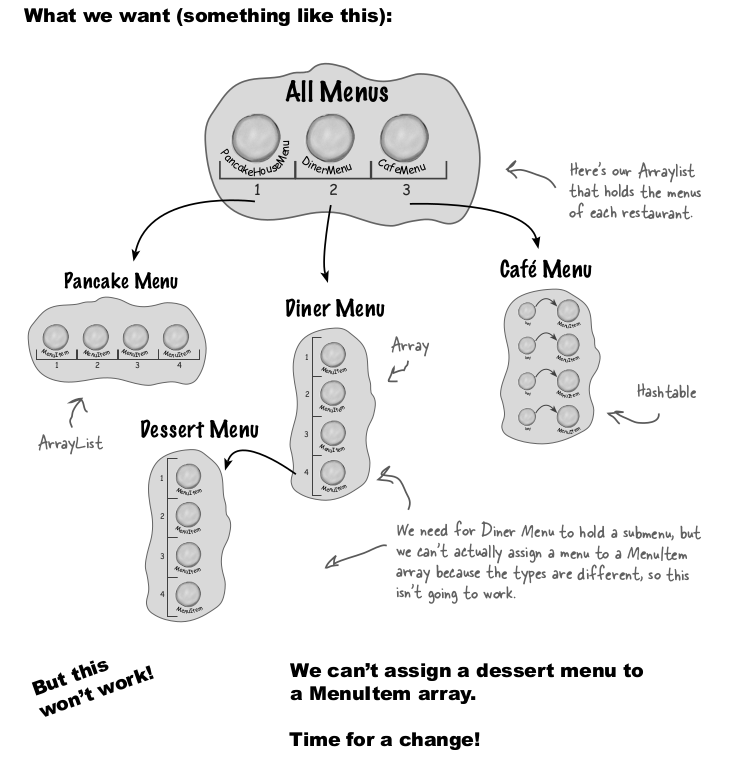
Sub menu within menu, how do we achieve this is where composite pattern come to rescue.
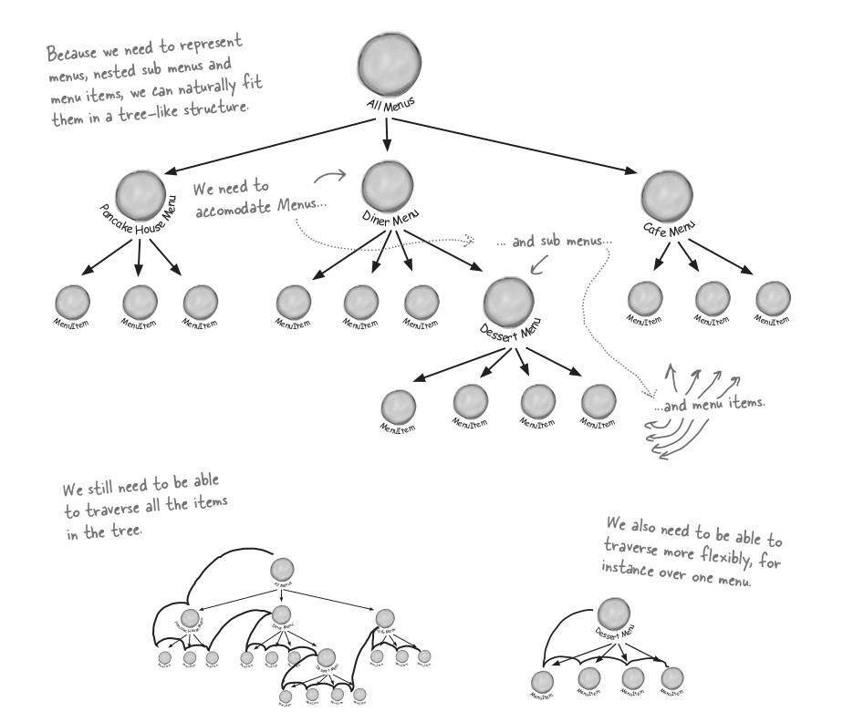
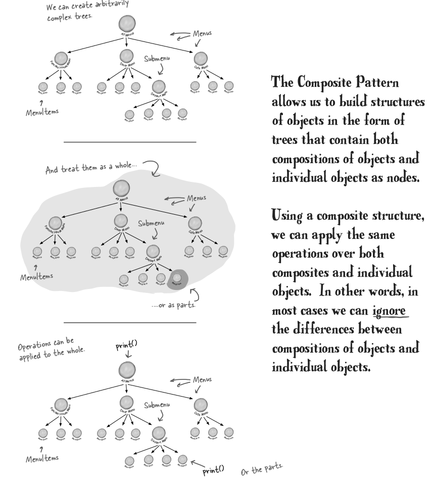
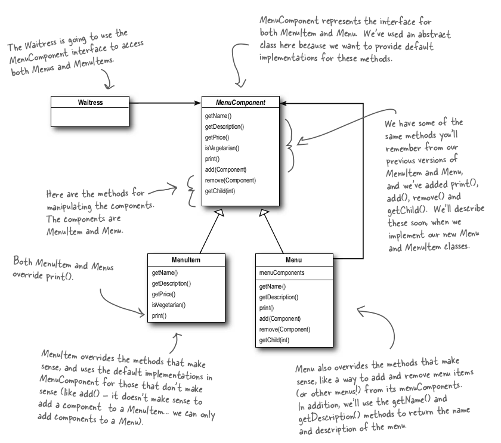
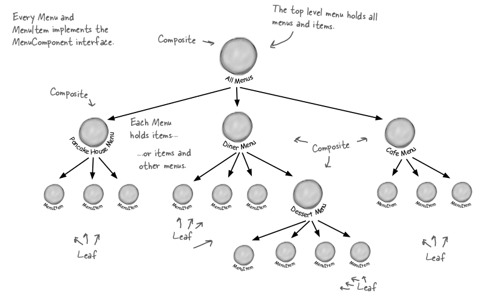

## Implementation

Define Menu component

```java
public class MenuComponent {
    public void add(MenuComponent menuComponent) {
        throw new UnsupportedOperationException();
    }
    public void remove(MenuComponent menuComponent) {
        throw new UnsupportedOperationException();
    }
    public MenuComponent getChild(int i) {
        throw new UnsupportedOperationException();
    }
    public String getName() {
        throw new UnsupportedOperationException();
    }
    public String getDescription() {
        throw new UnsupportedOperationException();
    }
    public double getPrice() {
        throw new UnsupportedOperationException();
    }
    public boolean isVegetarian() {
        throw new UnsupportedOperationException();
    }
    public void print() {
        throw new UnsupportedOperationException();
    }
}
```

Now

- MenuItem gonna implement MenuComponent
- Menu gonna implement MenuComponent

```java
public class MenuItem extends MenuComponent {

    String name;
    String description;
    boolean vegetarian;
    double price;

    public MenuItem(String name, String description, boolean vegetarian, double price) {
        this.name = name;
        this.description = description;
        this.vegetarian = vegetarian;
        this.price = price;
    }
    public String getName() {
        return name;
    }
    public String getDescription() {
        return description;
    }
    public double getPrice() {
        return price;
    }
    public boolean isVegetarian() {
        return vegetarian;
    }
    public void print() {
        System.out.print(" " + getName());
        if (isVegetarian()) {
            System.out.print("v)");
        }
        System.out.println(", " + getPrice());
        System.out.println(" -- "+ getDescription());
    }
}

public class Menu extends MenuComponent {

    ArrayList<MenuComponent> menuComponents = new ArrayList();
    String name;
    String description;
    public Menu(String name, String description) {
        this.name = name;
        this.description = description;
    }
    public void add(MenuComponent menuComponent) {
        menuComponents.add(menuComponent);
    }
    public void remove(MenuComponent menuComponent) {
        menuComponents.remove(menuComponent);
    }
    public MenuComponent getChild(int i) {
        return (MenuComponent)menuComponents.get(i);
    }
    public String getName() {
        return name;
    }
    public String getDescription() {
        return description;
    }

    public void print() {
        System.out.print("" + getName());
        System.out.println(", " + getDescription());
        System.out.println("--------------------");

        Iterator iterator = menuComponents.iterator();
        while (iterator.hasNext()) {
            MenuComponent menuComponent =
                    (MenuComponent)iterator.next();
            menuComponent.print();
        }
    }
}

```

Now waitress class code is just too small as compared to iterator Pattern, where Waitress was responsible to collect each menu data and print item via iterator of each menu.

Driver class code

```java
public class MenuTestDrive {
    public static void main(String[] args) {
        MenuComponent pancakeHouseMenu =
                new Menu("PANCAKE HOUSE MENU", "Breakfast");
        MenuComponent dinerMenu =
                new Menu("DINER MENU", "Lunch");
        MenuComponent cafeMenu =
                new Menu("CAFE MENU", "Dinner");
        MenuComponent dessertMenu =
                new Menu("DESSERT MENU", "Dessert of course!");

        MenuComponent allMenus = new Menu("ALL MENUS", "All menus combined");

        //pancake menu
        pancakeHouseMenu.add(new MenuItem("A & B's Pancake Breakfast","Pancake with eggs and toast",true,2.99));
        pancakeHouseMenu.add(new MenuItem("Regular Pancake Breakfast","Pancake with eggs and sausages",false,3.99));
        pancakeHouseMenu.add(new MenuItem("Blueberry Pancake Breakfast","Pancake with berry and sausages",true,4.99));
        allMenus.add(pancakeHouseMenu);


        dinerMenu.add(new MenuItem("Vegetarian BLT ","Falcon with tomato",true,2.99));
        dinerMenu.add(new MenuItem("Vegetarian BLT 2 ","Falcon with onion",true,2.99));
        dinerMenu.add(new MenuItem("Vegetarian BLT 3","Falcon with carrots",true,2.99));
        dinerMenu.add(new MenuItem("Hot Dog ","Topped with tomato, onion and cheeses",false,2.99));
        allMenus.add(dinerMenu);


        allMenus.add(cafeMenu);


        dinerMenu.add(dessertMenu);
        dessertMenu.add(new MenuItem(
                "Apple Pie",
                "Apple pie with a flakey crust, topped with vanilla icecream",
                true,                1.59));

                // add more menu items here
        Waitress waitress = new Waitress(allMenus);
        waitress.printMenu();
    }
}
```

## Recap Again

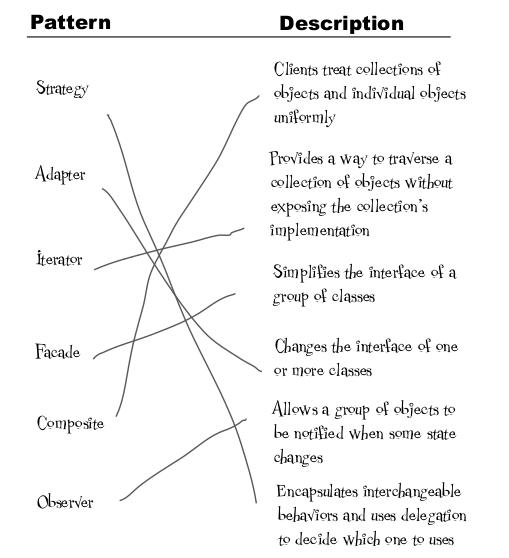

## Things to remember

- Structural Pattern
  - Because it organizes **objects into tree structures** to represent **whole-part hierarchies**. It lets individual objects and groups of objects be treated **uniformly**.
  - how objects are composed into trees, branches, and leaves.

# State Pattern

This pattern is made for designing those system which show different state behaviour.  
The State Pattern allows an object to alter its behavior when its internal state changes. The object will appear to change its class.

When using this pattern it would be like
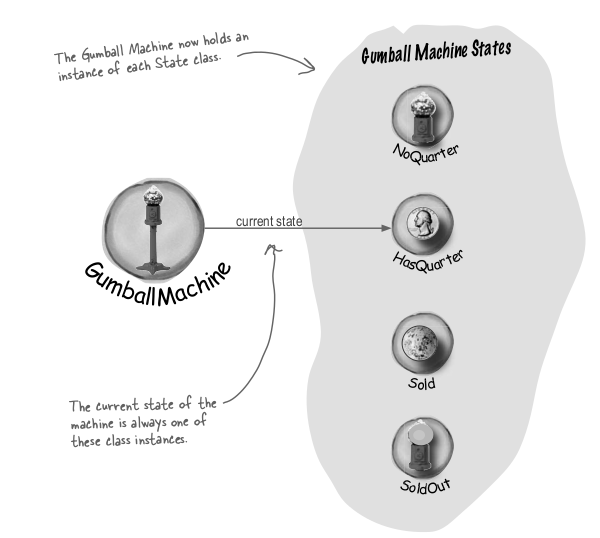
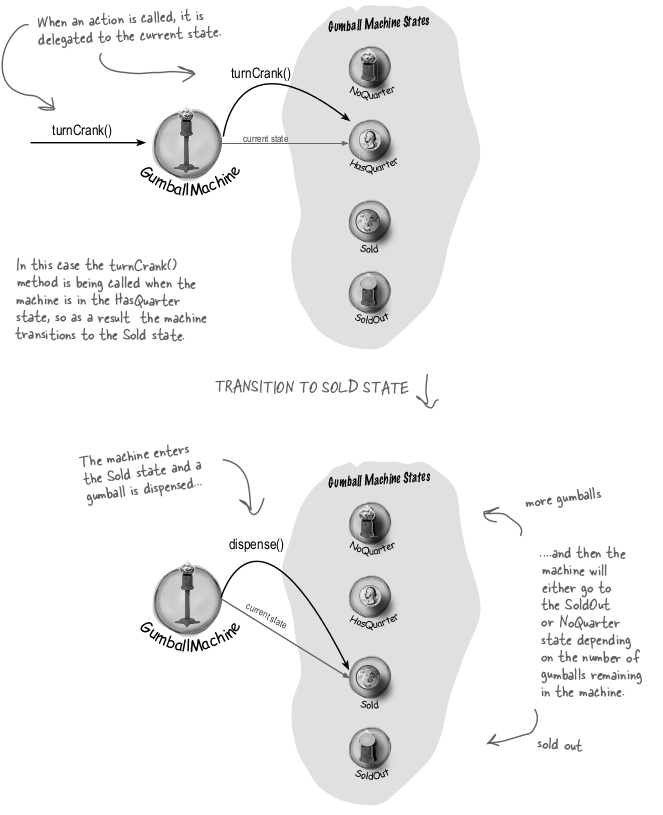

## Modelling Media Player using State Pattern

```java
public interface State {
    void pressPlay(MediaPlayer player);
}

public class PlayingState implements State {
    @Override
    public void pressPlay(MediaPlayer player) {
        System.out.println("Pausing the media...");
        player.setState(new PausedState());
    }
}

public class PausedState implements State {
    @Override
    public void pressPlay(MediaPlayer player) {
        System.out.println("Resuming the media...");
        player.setState(new PlayingState());
    }
}

public class StoppedState implements State {
    @Override
    public void pressPlay(MediaPlayer player) {
        System.out.println("Starting the media...");
        player.setState(new PlayingState());
    }
}

```

Media player code

```java
public class MediaPlayer {
    private State state;

    public MediaPlayer() {
        state = new StoppedState(); // Initial state
    }

    public void setState(State state) {
        this.state = state;
    }

    public void pressPlay() {
        state.pressPlay(this);
    }
}
```

Main class function

```java
public class Main {
    public static void main(String[] args) {
        MediaPlayer player = new MediaPlayer();

        player.pressPlay(); // Starting media... (Stopped → Playing)
        player.pressPlay(); // Pausing media... (Playing → Paused)
        player.pressPlay(); // Resuming media... (Paused → Playing)
    }
}
```

## Rewind

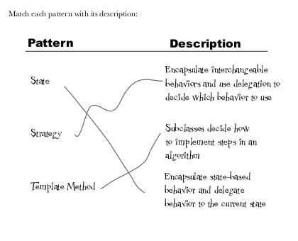

## Things to remember

- **Behavioral** pattern
- Because it is about **how an object behaves differently based on its internal state** — the behavior changes dynamically at runtime.

# All at once

Gang of Four has 23 Patterns

| Category       | Pattern Name            | Core Idea                                                            |
| -------------- | ----------------------- | -------------------------------------------------------------------- |
| **Creational** | Singleton               | Ensure a class has only one instance.                                |
|                | Factory Method          | Delegate instantiation to subclasses.                                |
|                | Abstract Factory        | Create families of related objects.                                  |
|                | Builder                 | Step-by-step construction of complex objects.                        |
|                | Prototype               | Clone existing objects without coupling.                             |
| **Structural** | Adapter                 | Connect incompatible interfaces.                                     |
|                | Bridge                  | Separate abstraction from implementation.                            |
|                | Composite               | Treat individual objects and groups uniformly.                       |
|                | Decorator               | Add responsibilities dynamically.                                    |
|                | Facade                  | Provide a simplified interface to a subsystem.                       |
|                | Flyweight               | Share objects to save memory (e.g., for many similar objects).       |
|                | Proxy                   | Provide a placeholder or surrogate to control access.                |
| **Behavioral** | Chain of Responsibility | Pass requests along a chain of handlers.                             |
|                | Command                 | Encapsulate a request as an object.                                  |
|                | Interpreter             | Define grammar and build an interpreter for a language.              |
|                | Iterator                | Access elements of a collection without exposing structure.          |
|                | Mediator                | Centralize communication between objects.                            |
|                | Memento                 | Capture and restore an object's state.                               |
|                | Observer                | Notify dependent objects when one object changes.                    |
|                | State                   | Change behavior based on object's internal state.                    |
|                | Strategy                | Define a family of algorithms, make them interchangeable.            |
|                | Template Method         | Define skeleton of an algorithm, defer steps to subclasses.          |
|                | Visitor                 | Add operations to existing object structures without modifying them. |

Full codebase [here](https://github.com/Dalakoti07/lengendary-design-patterns?tab=readme-ov-file)
