Start a server from python

`python -m http.server 8000`

I am trying to reproduce all the samples of coding math from this youtube channel. Do checkout his videos for its web implementation.

Welcome to Part ONE

# Task 1 - lets draw lines in canvas randomly

Something like this

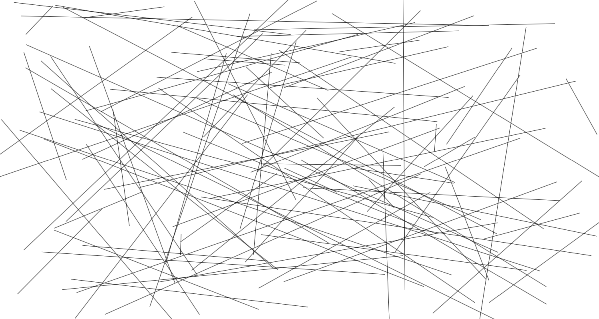

```kotlin

@Preview
@Composable
fun BasicLineDraws() {
    val numberOfLines by remember {
        mutableStateOf(50)
    }
    Canvas(modifier = Modifier.fillMaxSize(), onDraw = {
        val canvasWidth = size.width
        val canvasHeight = size.height

        for(i in 1..numberOfLines){
            val startOffsetX = Random.nextFloat()*canvasWidth
            val startOffsetY = Random.nextFloat()*canvasHeight

            val endOffsetX = Random.nextFloat()*canvasWidth
            val endOffsetY = Random.nextFloat()*canvasHeight

            drawLine(
                start = Offset(
                    x = startOffsetX,
                    y = startOffsetY,
                ),
                end = Offset(
                    x = endOffsetX,
                    y = endOffsetY,
                ),
                color = Color.Black,
                strokeWidth = 5.dp.toPx(),
            )
        }
    })
}

```

For Android we have

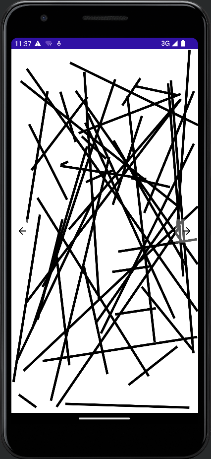

# Task 2 - Draw a sin Wave

Something like this. We can create bounce effect on basis of sin wave, object shrink and grow animation, all this is possible because sin value is continuous and between -1 and 1 and it repeats itself infinitely. So we can use this property in lots of places.
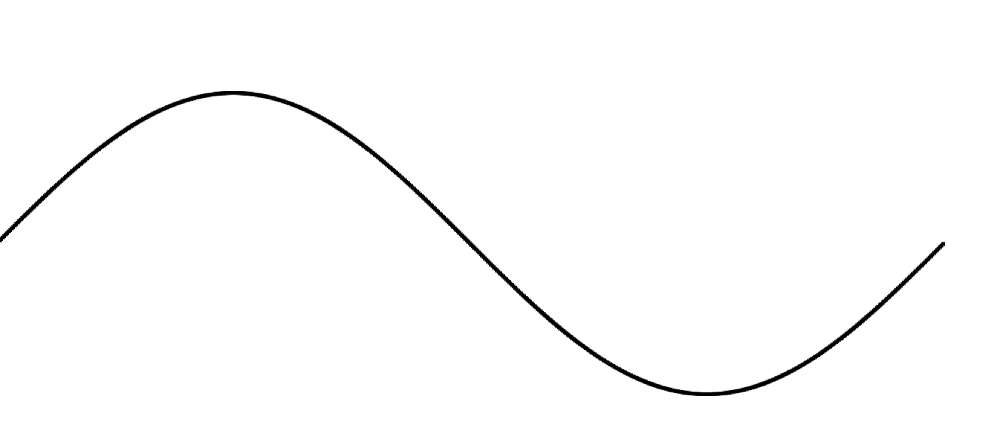

How do you create wave like this?

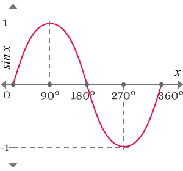

- One way is creating each dot at a time, and sweeping the angle from 0 to $2\pi$

The starting code is this but the result would be like

```kotlin


@Preview
@Composable
fun SimpleSinWave() {
    Canvas(modifier = Modifier
        .fillMaxSize(),
        onDraw = {
            val canvasHeight = size.height * 0.3

            val sinStartY = canvasHeight / 2
            var startAngle = 0.0f
            val finalAngle = (2 * Math.PI).toFloat()
            while (startAngle < finalAngle) {
                val pointX = startAngle * 100
                // add vertical offset
                val pointY = sin(startAngle.toDouble()) * 100 + sinStartY
                drawCircle(
                    color = Color.Black,
                    radius = 5f,
                    center = Offset(
                        x = pointX,
                        y = pointY.toFloat(),
                    )
                )
                startAngle += 0.01f
            }
        })
}

```

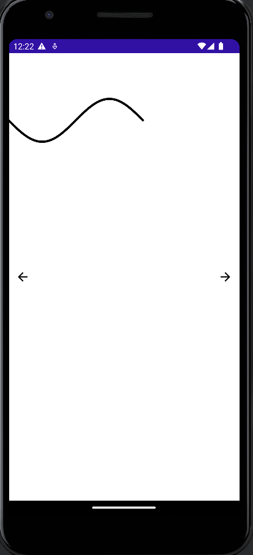

> WHY is it so?

because according to mobile cartesian system y axis is positive when we go down, and -ve when we go up, as compared to maths cartesian system which is inverse (+ve as we go up, and -ve as we go down)

==So that is why graph is flipped around X axis.==

How to fix it??

Options

- invert the canvas, bad idea, rotating the whole canvas would create lot of chaos
- if we see this graph carefully it looks like its graph of Sin $\pi$ to Sin $3\pi$
  - can we do something about it?
  - Will changing sin to cos help
    - It won't but it would give a different shape, do try it out
  - yes we can
    - add a phase of plus $\pi$ to it
    - High school mathematics 😂
    - wave would move along X axis, but it would travel along X?
      - Guess about it????

Yes and its done

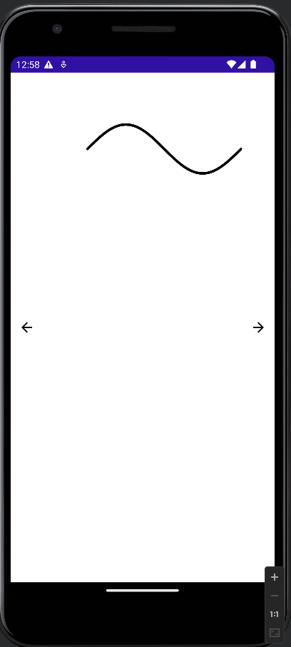

```kotlin


@Preview
@Composable
fun SimpleSinWave() {
    Canvas(modifier = Modifier
        .fillMaxSize(),
        onDraw = {
            val canvasHeight = size.height * 0.3

            val sinStartY = canvasHeight / 2
            var startAngle = Math.PI
            val finalAngle = (3 * Math.PI).toFloat()
            while (startAngle < finalAngle) {
                val pointX = startAngle * 100
                // add vertical offset
                val pointY = sin(startAngle) * 100 + sinStartY
                drawCircle(
                    color = Color.Black,
                    radius = 5f,
                    center = Offset(
                        x = pointX.toFloat(),
                        y = pointY.toFloat(),
                    )
                )
                startAngle += 0.01f
            }
        })
}

```

## Another approach

There has to be a better way of creating sin curve or curves in android, rather than drawing 1000's points.

> Can Bezier curve help?

Try it out??

Divide sin wave into 2 bezier curves, such that it pivots at 0

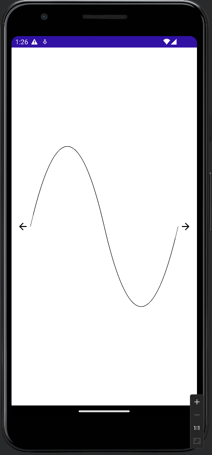

```kotlin

Canvas(
    modifier = Modifier
        .fillMaxSize()
        .padding(
            all = 40.dp,
        ),
    onDraw = {
        val canvasHeight = size.height
        val canvasWidth = size.width

        Log.d(TAG, "SimpleSinWave: width -> $canvasWidth and height -> $canvasHeight")

        val path = Path()

        // first half
        path.moveTo(0f, (canvasHeight * 0.5f))
        path.quadraticBezierTo(
            canvasWidth * 0.25f,
            0f,
            canvasWidth * 0.5f,
            canvasHeight * 0.5f,
        )

        path.moveTo(canvasWidth * 0.5f, (canvasHeight * 0.5f))
        // second half
        path.quadraticBezierTo(
            canvasWidth * 0.75f,
            canvasHeight,
            canvasWidth,
            canvasHeight * 0.5f,
        )

        drawPath(
            path = path,
            color = Color.Black,
            style = Stroke(
                width = 1.dp.toPx(),
            )
        )
    },
)

```

# Task 3 - Bounce animation

In web
![[bounce animation.mov]]

In web it is done using something like this,

```js
var centerY = height * 0.5,
  centerX = width * 0.5,
  offset = height * 0.4,
  speed = 0.1,
  angle = 0;

bounceAnimation();

/**

* this function will bounce the ball

*/

function bounceAnimation() {
  let y = centerY + Math.sin(angle) * offset;

  // clear canvas

  context.clearRect(0, 0, width, height);

  context.beginPath();

  // create circle

  context.arc(centerX, y, 50, 0, 2 * Math.PI, false);

  context.fill();

  angle += speed;

  requestAnimationFrame(bounceAnimation);
}
```

`requestAnimationFrame` tells browser that we want animation, and hence it calls this callback depending upon machine's refresh rate which is 60FPS or 60Hz. [Docs](https://developer.mozilla.org/en-US/docs/Web/API/window/requestAnimationFrame)

Similar can be achieved in android, but that would be ==non performant==, so let's do something from compose APIs to create the same effect.

```kotlin

@Composable
fun Dp.dpToPx() = with(LocalDensity.current) { this@dpToPx.toPx() }


@Preview
@Composable
fun BouncingBall(){
    BoxWithConstraints(modifier = Modifier.fillMaxSize()){
        val infiniteTransition = rememberInfiniteTransition("bouncing effect")

        val ballRadius = 40.dp

        val width = maxWidth.dpToPx()
        val height = maxHeight.dpToPx() - (ballRadius*2).dpToPx()
        val ballRadiusInPx = ballRadius.dpToPx()

        val offset by infiniteTransition.animateFloat(
            targetValue = height,
            initialValue = 0f,
            label = "animate-offset",
            animationSpec = infiniteRepeatable(
                animation = tween(
                    durationMillis = 3_000,
                    easing = LinearEasing,
                ),
                repeatMode = RepeatMode.Reverse,
            )
        )
        Box(
            modifier = Modifier
                .size(ballRadius * 2)
                .offset {
                    IntOffset(
                        x = ((width * 0.5f).toInt() - ballRadiusInPx).toInt(),
                        y = offset.toInt(),
                    )
                }
                .clip(
                    CircleShape
                )
                .background(
                    color = Color.Black,
                )
        )
    }

}

```

> Well, well, and well, Grab a coffee and play around with different ease in Effects

> In compose chaining does matter, change the changing order in Black box, like put offset to last, you would see that box never moves, actually its moving

We did following things

- create infinite transition, which would be revered from `top to bottom`, and then `bottom to top` and repeat and so on
- animate offset value, since only y is changing, x is constant this works fine

# Task 4 - Circular motion

![[round motion.mov]]

We would be using the following diagram to create effect like this

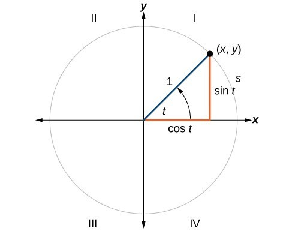

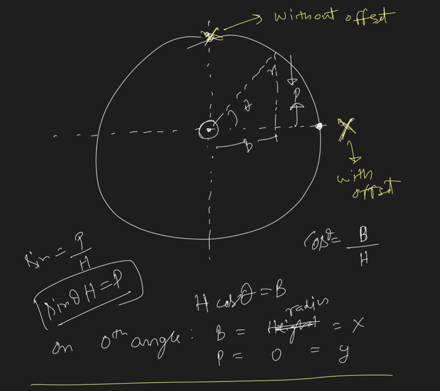

Now with extra offset added, we would have motion starting from center right.

Full code [here]()

# Task 5 - Object in circular path

Well this one was tricky, and had to do some sort of mirroring across the y axis to achieve the results

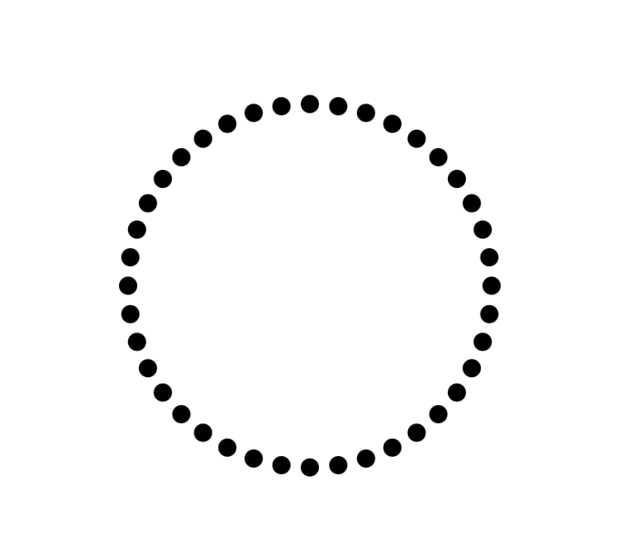

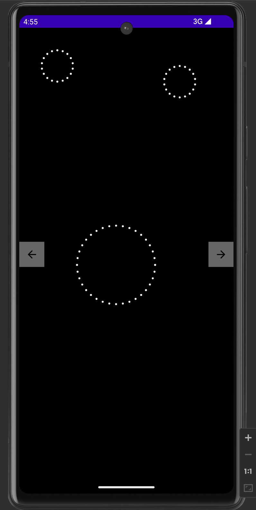

Full code [here]()

# Task 6 - Elliptical Path

Motion in Elliptical Path, just a change in circular path.

Full code [here]()

# Task 7 - Pointer pointing to you

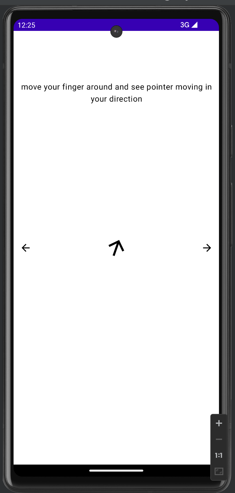

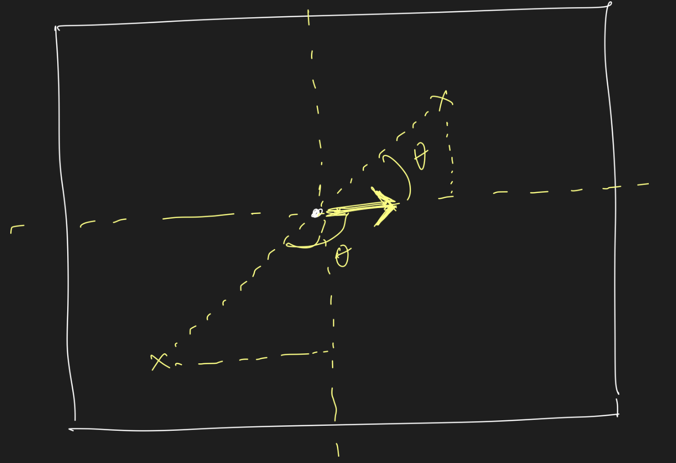

Full code [here]()
