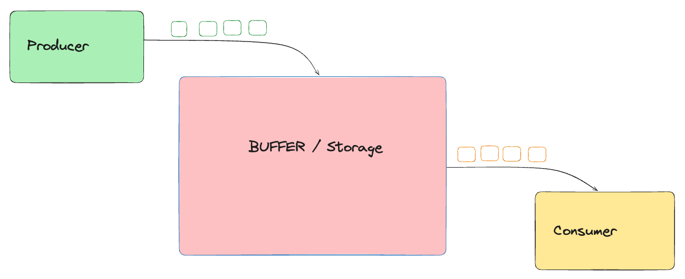
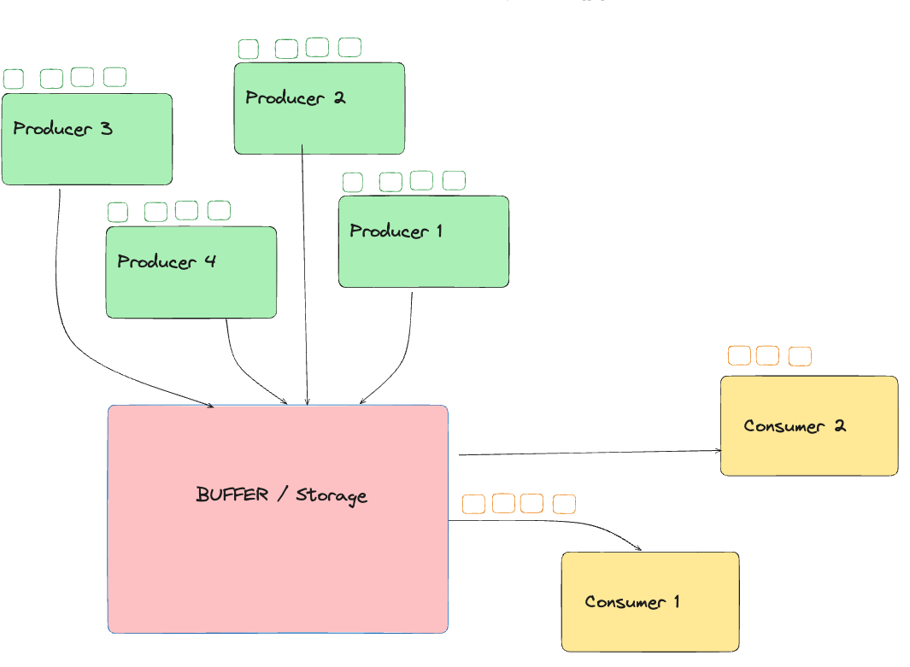

# Overview

Producer-Consumer problem is a classical synchronization problem in the operating system. With the presence of more than one process and limited resources in the system the synchronization problem arises. If one resource is shared between more than one process at the same time then it can lead to data inconsistency. In the producer-consumer problem, the producer produces an item and the consumer consumes the item produced by the producer.

# Problem

- there is a producer, and there is a consumer
- producer produces things
- consumer consumes things
- consider a factory
  - where `producer` put things
  - and from this factory consumer put things

```kotlin
// Shared buffer without synchronization
class SharedBuffer {
    private val items = mutableListOf<Int>()

    // No synchronization around items.add(...)
    fun produce(item: Int) {
        items.add(item)
    }

    // No synchronization around items.removeAt(...)
    fun consume(): Int? {
        return if (items.isNotEmpty()) {
            // Potential race condition, might throw an exception or return incorrect data
            items.removeAt(0)
        } else {
            null
        }
    }
}
```



# Assumptions

- Buffer is too large, no constraint on its size
- Only 1 producer and only 1 consumer

At later point of time, we would be doing limited buffer + more than 1 producer + more than 1 consumer

# The First Attempt

```kotlin

fun main() {
    val buffer = SharedBuffer()
    val totalItems = 1000

    // Producer Thread
    val producer = thread {
        for (i in 1..totalItems) {
            buffer.produce(i)
            println("produced item $i")
            // Simulate some processing delay
            Thread.sleep(1)
        }
        println("Producer finished producing $totalItems items.")
    }

    // Consumer Thread
    val consumer = thread {
        var consumedCount = 0
        while (consumedCount < totalItems) {
            val item = buffer.consume()
            if (item != null) {
                println("Consumed: $item")
                consumedCount++
            } else {
                // Race condition: Consumer finds the buffer empty even though more items might be coming
                println("Buffer was empty unexpectedly!")
            }
            Thread.sleep(2)
        }
        println("Consumer finished consuming $consumedCount items.")
    }

    // Wait for both threads to finish
    producer.join()
    consumer.join()

    println("Main thread finished.")
}
```

## Outputs Problem 1

```txt
Consumed: 689
Consumed: 690
Consumed: 692
Consumed: 693
```

in above output `691` was missing, WHY?

## Outputs Problem 2

```txt
Consumed: 995
Consumed: 996
Consumed: 997
Consumed: 998
Consumed: 999
Consumed: 1000
Buffer was empty unexpectedly!
Buffer was empty unexpectedly!
Buffer was empty unexpectedly!
```

why did we get such outputs

- Producer was producing at 2x speed as compared to consumer
- As a result, we had 1000 produced with us way early, and at this point consumer would have consumed around 500 items
- Now it happened that `consumedCount++` did some chaos and since it was not atomic and hence `++` was not done right and hence we got stuck in this `Buffer was empty unexpectedly!` error infinitely

Reason for above 2 outputs

> It can be said that 2 threads are competing against each other, one is adding item and one is removing item, now this can lead to race condition and inconsistent results.

### The Solution?

> Make this ++ atomic, lets see

No improvements, as explained below

> `consumedCount++` translates into multiple steps internally (read → increment → write). If two threads call this simultaneously, one update could “overwrite” the other, resulting in a lost increment. An `AtomicInteger` ensures that all increments happen atomically (in a thread-safe manner), so your final count will always be accurate.

But it was just one thread in above case

# Second Attempt

> Assumption, buffer is too large, no constraint on its size

> Mutex api's are coroutine/suspend types, so lets use ReentrantLock

Modifying `SharedBuffer` Code

```kotlin
// Shared buffer without synchronization
class SharedBuffer {
    private val items = mutableListOf<Int>()
    private val lock = ReentrantLock()

    // No synchronization around items.add(...)
    fun produce(item: Int) {
        lock.withLock {
            items.add(item)
        }
    }

    // No synchronization around items.removeAt(...)
    fun consume(): Int? {
        lock.withLock {
            return if (items.isNotEmpty()) {
                // Potential race condition, might throw an exception or return incorrect data
                items.removeAt(0)
            } else {
                null
            }
        }
    }
}
```

## Output

```txt
Consumed: 994
Consumed: 995
Consumed: 996
Consumed: 997
Consumed: 998
Consumed: 999
Consumed: 1000
Consumer finished consuming 1000 items.
Main thread finished.
```

So that `Buffer was empty unexpectedly!` problem is solved.

The earlier problems happened because of race condition and now with locks its solved.

# Fixed sized buffer

Now, we have to create a signalling mechanism to tell another thread that unblock itself as condition is true

- Producer would be blocked if buffer is already full
- Consumer would be blocked if buffer is empty

A **signaling mechanism** (e.g., condition variables) allows threads to:

- **Block** when they can’t make progress (producer waiting for space, consumer waiting for an item).
- **Resume** immediately once the condition has changed (producer is signaled that space is free; consumer is signaled that new items are available).

```kotlin
// Shared buffer without synchronization
class FixedBuffer(private val capacity: Int = 10) {
    private val items = mutableListOf<Int>()

    // Mutex/Lock
    private val lock = ReentrantLock()

    // Condition variables
    private val notFull: Condition = lock.newCondition()
    private val notEmpty: Condition = lock.newCondition()

    fun produce(item: Int) {
        lock.withLock {
            // If the buffer is full, wait until there's space
            while (items.size == capacity) {
                println("Producer waiting... (buffer full with ${items.size} items)")
                notFull.await()
            }

            // Now we can safely add
            items.add(item)
            println("Produced: $item | Buffer size: ${items.size}")

            // Signal that there's now something to consume
            notEmpty.signal()
        }
    }

    fun consume(): Int {
        lock.withLock {
            // If the buffer is empty, wait until there's an item
            while (items.isEmpty()) {
                println("Consumer waiting... (buffer empty)")
                notEmpty.await()
            }

            // Remove item
            val removed = items.removeAt(0)
            println("Consumed: $removed | Buffer size: ${items.size}")

            // Signal producer that there's space now
            notFull.signal()

            return removed
        }
    }
}
```

# Other Signalling mechanism

## BlockingQueue

Specially designed for this problem, it blocks while putting if buffer is full, and similarly it blocks when taking data out if buffer is already empty.

```kotlin
// Shared buffer without synchronization
class FixedBuffer(private val capacity: Int = 10) {
    // Create a blocking queue with fixed capacity.
    private val queue: BlockingQueue<Int> = ArrayBlockingQueue(capacity)

    // Produces an item by putting it into the queue. Blocks if full.
    fun produce(item: Int) {
        queue.put(item)  // Blocks if the queue is full.
        println("Produced: $item | Buffer size: ${queue.size}")
    }

    // Consumes an item by taking it from the queue. Blocks if empty.
    fun consume(): Int {
        val item = queue.take()  // Blocks if the queue is empty.
        println("Consumed: $item | Buffer size: ${queue.size}")
        return item
    }
}
```

## Channels

```kotlin
// FixedBuffer class that uses a Channel with fixed capacity.
class FixedBuffer<T>(capacity: Int = 10) {
    private val channel = Channel<T>(capacity)

    // Produces an item by sending it to the channel.
    // If the channel (buffer) is full, this suspends until space is available.    suspend fun produce(item: T) {
        channel.send(item)
        // remainingCapacity tells us how many more items can be added before blocking.
        println("Produced: $item")
    }

    // Consumes an item by receiving it from the channel.
    // If the channel is empty, this suspends until an item is available.    suspend fun consume(): T {
        val item = channel.receive()
        println("Consumed: $item")
        return item
    }
}

fun main() = runBlocking {
    val totalItems = 100
    val buffer = FixedBuffer<Int>(10) // Fixed buffer with capacity 10

    // Launch a coroutine for the producer.    val producer = launch {
        for (i in 1..totalItems) {
            buffer.produce(i)
            delay(50)  // Simulate a fast production pace
        }
        println("Producer finished producing $totalItems items.")
    }

    // Launch a coroutine for the consumer.
    val consumer = launch {
        repeat(totalItems) {
            buffer.consume()
            delay(150) // Simulate a slower consumption pace
        }
        println("Consumer finished consuming $totalItems items.")
    }

    producer.join()
    consumer.join()
    println("Main coroutine finished.")
}
```

> Channels were introduced as a high-level, coroutine-friendly abstraction for communication and synchronization between concurrent tasks. Rather than manually handling low-level thread synchronization primitives like locks and condition variables, channels provide a way to safely pass messages (or data) between producers and consumers.

# More than 1 producer and more than 1 consumer



```kotlin
fun main() {
    val buffer = FixedBuffer(10)

    // Settings: 3 producers and 3 consumers.
    val totalProducers = 3
    val totalConsumers = 3
    // Each producer produces 20 items (total 60 items).
    val itemsPerProducer = 20
    // Each consumer consumes 20 items (total 60 items).
    val itemsPerConsumer = 20

    // List to keep track of producer and consumer threads.
    val producers = mutableListOf<Thread>()
    val consumers = mutableListOf<Thread>()

    // Launch multiple producers.
    for (p in 1..totalProducers) {
        val producerThread = thread(start = true) {
            for (i in 1..itemsPerProducer) {
                // Unique item number: calculates an overall sequence.
                val item = (p - 1) * itemsPerProducer + i
                buffer.produce(item)
                Thread.sleep(50) // Fast production pace.
            }
            println("Producer $p finished producing $itemsPerProducer items.")
        }
        producers.add(producerThread)
    }

    // Launch multiple consumers.
    for (c in 1..totalConsumers) {
        val consumerThread = thread(start = true) {
            for (i in 1..itemsPerConsumer) {
                buffer.consume()
                Thread.sleep(100) // Slower consumption pace.
            }
            println("Consumer $c finished consuming $itemsPerConsumer items.")
        }
        consumers.add(consumerThread)
    }

    // Wait for all threads to complete.
    producers.forEach { it.join() }
    consumers.forEach { it.join() }

    println("Main thread finished.")
}
```

That is it!
