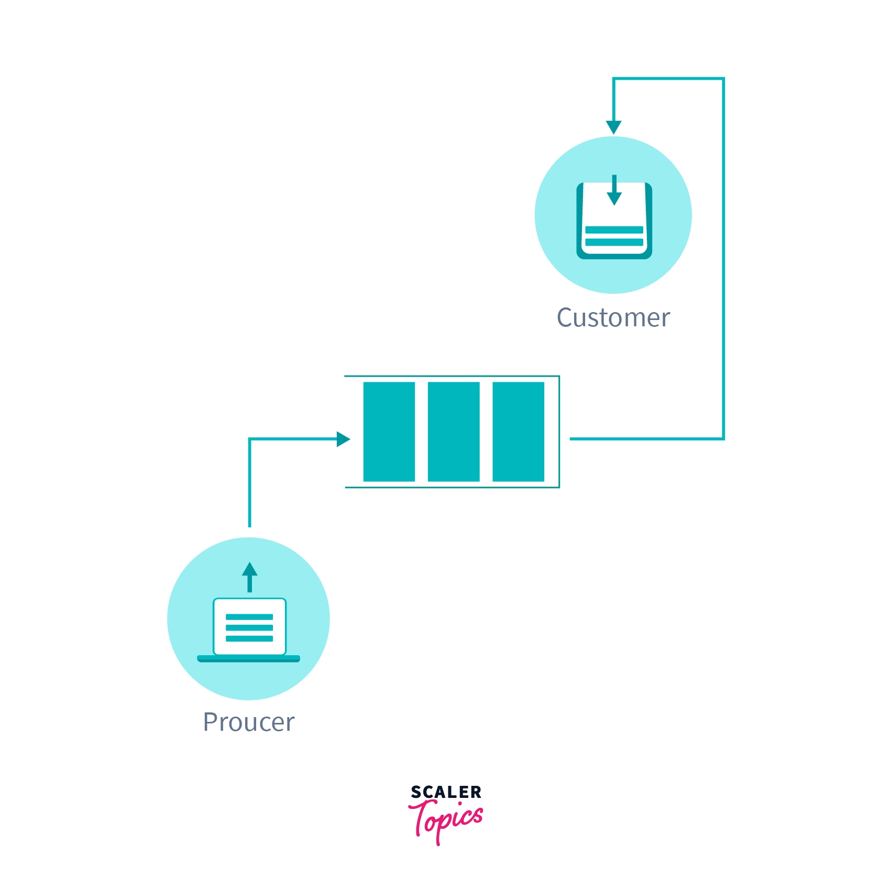

# Overview

Producer-Consumer problem is a classical synchronization problem in the operating system. With the presence of more than one process and limited resources in the system the synchronization problem arises. If one resource is shared between more than one process at the same time then it can lead to data inconsistency. In the producer-consumer problem, the producer produces an item and the consumer consumes the item produced by the producer.

# What is Producer Consumer Problem?

Before knowing what is Producer-Consumer Problem we have to know what are Producer and Consumer.

- In operating System **Producer is a process which is able to produce data/item**.
- Consumer is a **Process that is able to consume the data/item produced by the Producer**.
- Both Producer and Consumer share a common memory buffer. This buffer is a space of a certain size in the memory of the system which is used for storage. The producer produces the data into the buffer and the consumer consumes the data from the buffer.



So, what are the Producer-Consumer Problems?

1. Producer Process should not produce any data when the shared buffer is full.
2. Consumer Process should not consume any data when the shared buffer is empty.
3. The access to the shared buffer should be mutually exclusive i.e at a time only one process should be able to access the shared buffer and make changes to it.

For consistent data synchronization between Producer and Consumer, the above problem should be resolved.

# Solution For Producer Consumer Problem

To solve the Producer-Consumer problem three **semaphores variable** are used :

> Semaphores are variables used to indicate the number of resources available in the system at a particular time. semaphore variables are used to achieve `Process Synchronization.

## Full

The full variable is used to track the space filled in the buffer by the Producer process. It is initialized to 0 initially as initially no space is filled by the Producer process.

## Empty

The Empty variable is used to track the empty space in the buffer. The Empty variable is initially initialized to the **BUFFER-SIZE** as initially, the whole buffer is empty.

## Mutex

Mutex is used to achieve mutual exclusion. mutex ensures that at any particular time only the producer or the consumer is accessing the buffer.

**Mutex** - mutex is a binary semaphore variable that has a value of 0 or 1.

We will use the Signal() and wait() operation in the above-mentioned semaphores to arrive at a solution to the Producer-Consumer problem.

**Signal()** - The signal function increases the semaphore value by 1. **Wait()** - The wait operation decreases the semaphore value by 1.

Let's look at the code of Producer-Consumer Process

The code for Producer Process is as follows :

```c
void Producer(){
    while(true){
        // producer produces an item/data
        wait(Empty);
        wait(mutex);
        add();
        signal(mutex);
        signal(Full);
    }
}
```

Let's understand the above Producer process code :

- **wait(Empty)** - Before producing items, the producer process checks for the empty space in the buffer. If the buffer is full producer process waits for the consumer process to consume items from the buffer. so, the producer process executes wait(Empty) before producing any item.
- **wait(mutex)** - Only one process can access the buffer at a time. So, once the producer process enters into the critical section of the code it decreases the value of mutex by executing wait(mutex) so that no other process can access the buffer at the same time.
- **add()** - This method adds the item to the buffer produced by the Producer process. once the Producer process reaches add function in the code, it is guaranteed that no other process will be able to access the shared buffer concurrently which helps in data consistency.
- **signal(mutex)** - Now, once the Producer process added the item into the buffer it increases the mutex value by 1 so that other processes which were in a busy-waiting state can access the critical section.
- **signal(Full)** - when the producer process adds an item into the buffer spaces is filled by one item so it increases the Full semaphore so that it indicates the filled spaces in the buffer correctly.

The code for the Consumer Process is as follows :

```c
void Consumer() {
    while(true){
    // consumer consumes an item
        wait(Full);
        wait(mutex);
        consume();
        signal(mutex);
        signal(Empty);
    }
}
```

Let's understand the above Consumer process code :

- **wait(Full)** - Before the consumer process starts consuming any item from the buffer it checks if the buffer is empty or has some item in it. So, the consumer process creates one more empty space in the buffer and this is indicated by the full variable. The value of the full variable decreases by one when the wait(Full) is executed. If the Full variable is already zero i.e the buffer is empty then the consumer process cannot consume any item from the buffer and it goes in the busy-waiting state.
- **wait(mutex)** - It does the same as explained in the producer process. It decreases the mutex by 1 and restricts another process to enter the critical section until the consumer process increases the value of mutex by 1.
- **consume()** - This function consumes an item from the buffer. when code reaches the consuming () function it will not allow any other process to access the critical section which maintains the data consistency.
- **signal(mutex)** - After consuming the item it increases the mutex value by 1 so that other processes which are in a busy-waiting state can access the critical section now.
- **signal(Empty)** - when a consumer process consumes an item it increases the value of the Empty variable indicating that the empty space in the buffer is increased by 1.

# Why can mutex solve the producer consumer Problem ?

Mutex is used to solve the producer-consumer problem as mutex helps in mutual exclusion. It prevents more than one process to enter the critical section. As mutexes have binary values i.e 0 and 1. So whenever any process tries to enter the critical section code it first checks for the mutex value by using the wait operation.

## wait(mutex);

wait(mutex) decreases the value of mutex by 1. so, suppose a process P1 tries to enter the critical section when **mutex value is 1**. P1 executes wait(mutex) and decreases the value of mutex. Now, the **value of mutex becomes 0** when P1 enters the critical section of the code.

Now, suppose Process P2 tries to enter the critical section then it will again try to decrease the value of mutex. But the mutex value is already 0. So, wait(mutex) will not execute, and P2 will now keep waiting for P1 to come out of the critical section.

Now, suppose if P2 comes out of the critical section by executing signal(mutex).

## signal(mutex)

signal(mutex) increases the value of mutex by 1.**mutex value again becomes 1**. Now, the process P2 which was in a busy-waiting state will be able to enter the critical section by executing wait(mutex).

So, mutex helps in the mutual exclusion of the processes.

In the above section in both the Producer process code and consumer process code, we have the wait and signal operation on mutex which helps in mutual exclusion and solves the problem of the Producer consumer process.

# The code

```go
package main

import (
   "fmt"
   "sync"   "time")

// Define buffer size and maximum items
const (
   BufferSize = 10
   MaxItems   = 100
)

// Shared buffer and synchronization primitivesvar (
   buffer      = make([]int, 0, BufferSize)
   bufferMutex sync.Mutex
   cond        = sync.NewCond(&bufferMutex)
)

// Producer function
func producer(id int, wg *sync.WaitGroup) {
   defer wg.Done()
   for i := 0; i < MaxItems; i++ {
      time.Sleep(time.Millisecond * 100) // Simulate work

      // Lock the mutex before accessing the buffer      bufferMutex.Lock()
      for len(buffer) == BufferSize {
         // Wait until there is space in the buffer
         cond.Wait()
      }
      // Add item to buffer
      buffer = append(buffer, i)
      fmt.Printf("Producer %d produced %d\n", id, i)
      // Signal the consumer that an item has been added
      cond.Signal()
      // Unlock the mutex
      bufferMutex.Unlock()
   }
}

// Consumer function
func consumer(id int, wg *sync.WaitGroup) {
   defer wg.Done()
   for i := 0; i < MaxItems; i++ {
      time.Sleep(time.Millisecond * 200) // Simulate work

      // Lock the mutex before accessing the buffer      bufferMutex.Lock()
      for len(buffer) == 0 {
         // Wait until there is an item in the buffer
         cond.Wait()
      }
      // Remove item from buffer
      item := buffer[0]
      buffer = buffer[1:]
      fmt.Printf("Consumer %d consumed %d\n", id, item)
      // Signal the producer that space has been freed in the buffer
      cond.Signal()
      // Unlock the mutex
      bufferMutex.Unlock()
   }
}

func main() {
   var wg sync.WaitGroup

   // Start producer and consumer goroutines
   for i := 0; i < 2; i++ {
      wg.Add(1)
      go producer(i, &wg)
   }

   for i := 0; i < 2; i++ {
      wg.Add(1)
      go consumer(i, &wg)
   }

   // Wait for all goroutines to finish
   wg.Wait()
}
```

Its quite simple we see we are using `sync.NewCond` to sync between goroutines
