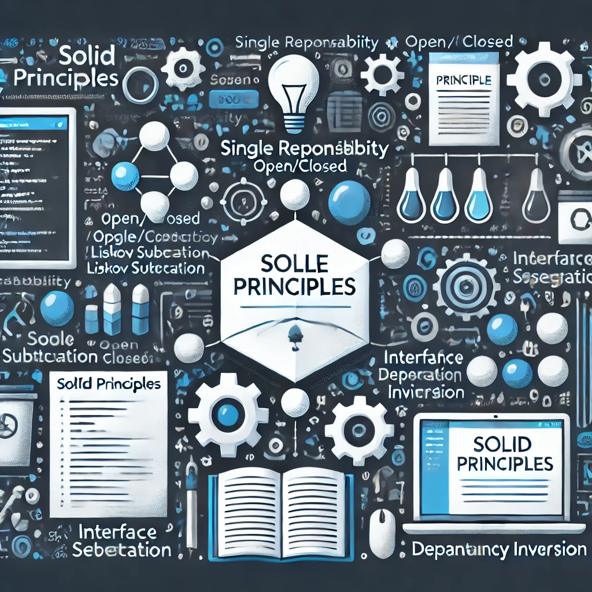
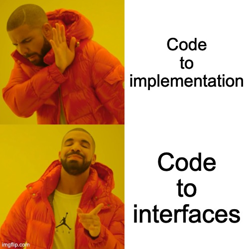
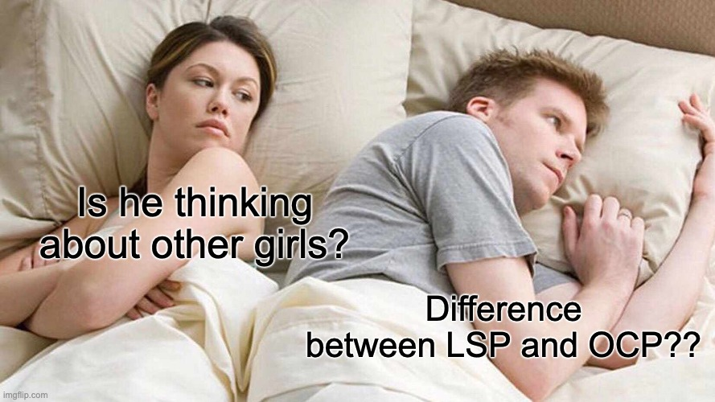

SOLID stands For

- S - **Single Responsibility Principle (SRP)**
- **O** - Open/Closed Principle (OCP)
- **L** - **Liskov Substitution Principle (LSP)**
- **I** - **Interface Segregation Principle (ISP)**
- **D** - **Dependency Inversion Principle (DIP)**

# TLDR

SRP -
OCP -  
LSP -
ISP -
DIP -

# Single Responsibility Principle (SRP)

It just means that `A class is supposed to have one responsibilty (core responsibility), not more not less`. This make things simpler and easy to maintain.

## Backend Engineering

In backend development, imagine you’re building a system that handles user accounts. According to SRP, you should have separate classes or modules for different responsibilities. For example:

- **UserManager**: This class handles user-related operations like creating, updating, and deleting user accounts.
- **EmailService**: This class sends emails, such as welcome messages or password resets.
- **Logger**: This class records log entries for debugging and tracking system activities.

Each class has a single responsibility: `UserManager` deals with user accounts, `EmailService` handles email, and `Logger` takes care of logging. This makes the system easier to maintain and update because changes in one area won’t affect the others.

## **Android Development**

In Android development, think about a screen in your app that shows user profiles. You might have:

- **UserProfileActivity**: This is the screen where the user profile is displayed.
- **UserProfileViewModel**: This handles the logic of fetching and preparing the user data for the view.
- **UserProfileAdapter**: This manages how the profile data is displayed in a list or grid.

Each component has a specific responsibility: `UserProfileActivity` manages the UI, `UserProfileViewModel` handles the data, and `UserProfileAdapter` deals with displaying the data. If you need to change how data is displayed or handled, you only need to update the relevant part without affecting the other components.

## Non-Engineering Example

Let’s use a school scenario:

- **Teacher**: A teacher’s responsibility is to teach subjects and guide students.
- **Librarian**: A librarian’s job is to manage the library and help students find books.
- **Principal**: The principal handles the overall management of the school and makes important decisions.

In this setup, each role has a single, clear responsibility. A teacher doesn’t handle library books or make school policies, which makes each role more effective at its specific job.


# Open Close Principle (OCP)

It advocate for `coding to interfaces rather than concrete implementations. This approach promotes flexibility and extensibility in your codebase.`

## **Backend Development**

Imagine you’re building an online shopping system with different types of discounts:

- **DiscountService**: This class calculates discounts for orders.

Initially, it might only handle a fixed discount. But, according to OCP, you should design it so that you can easily add new types of discounts without modifying the existing `DiscountService` class.

Here’s how you could implement it:

- **DiscountService**: Uses an interface `DiscountStrategy` to calculate discounts.
- **FixedDiscountStrategy**: Implements `DiscountStrategy` to handle fixed discounts.
- **PercentageDiscountStrategy**: Implements `DiscountStrategy` to handle percentage-based discounts.

When you need to add a new discount type, you simply create a new class that implements `DiscountStrategy` without changing `DiscountService`. This keeps your codebase stable and allows you to extend functionality easily.

## **Android Development**

Suppose you’re developing an Android app that tracks user interactions through various analytics services. You have a system that logs events to different analytics platforms:

**AnalyticsManager**: Handles the logging of events to different analytics services. Initially, it might only support logging to Mixpanel. To follow OCP:

- **AnalyticsManager**: Uses an interface `AnalyticsLogger` to define how events should be logged.
- **MixpanelLogger**: Implements `AnalyticsLogger` for logging events to Mixpanel.
- **GoogleAnalyticsLogger**: Implements `AnalyticsLogger` for logging events to Google Analytics.
- **MoEngageLogger**: Implements `AnalyticsLogger` for logging events to MoEngage.

By using this design, `AnalyticsManager` can work with any analytics service that implements the `AnalyticsLogger` interface, and you can easily extend it to support new services without modifying the existing code.

## **Non-Engineering Example**

Let’s use a restaurant scenario:

- **Menu**: This is the list of dishes a restaurant offers.

Initially, the restaurant offers burgers and pizzas. To follow OCP:

- **MenuItem**: A class representing a menu item.
- **Burger**: A subclass of `MenuItem` for burgers.
- **Pizza**: A subclass of `MenuItem` for pizzas.

When you want to add a new dish, like pasta, you create a new class `Pasta` that extends `MenuItem` without changing the existing `Menu` or `MenuItem` classes. This allows you to expand the menu without altering existing code.



# Liskov Substitution Principle (LSP)

States that `objects of a superclass should be replaceable with objects of a subclass without altering the correctness of the program.`

## **Backend Example**

Imagine you’re developing a backend system for a payment processing application. You have a base class for different types of payment methods:

- **PaymentMethod**: A base class representing general payment methods with a method `processPayment(amount: Double)`.

You have different subclasses for specific payment methods:

- **CreditCardPayment**: A subclass that processes payments via credit card.
- **PayPalPayment**: A subclass that processes payments via PayPal.

According to LSP:

- **CreditCardPayment** and **PayPalPayment** should be able to replace `PaymentMethod` in any part of the system without breaking functionality.

```java
class PaymentMethod {
    public void processPayment(double amount) {
        // General payment processing logic
    }
}

class CreditCardPayment extends PaymentMethod {
    @Override
    public void processPayment(double amount) {
        // Credit card-specific payment processing logic
    }
}

class PayPalPayment extends PaymentMethod {
    @Override
    public void processPayment(double amount) {
        // PayPal-specific payment processing logic
    }
}

public void handlePayment(PaymentMethod paymentMethod, double amount) {
    paymentMethod.processPayment(amount);
}

```

You can use either `CreditCardPayment` or `PayPalPayment` with `handlePayment` without causing errors or unexpected behavior.

## **Android Example**

Imagine you’re working on an Android app that handles different types of user notifications. You have a base class for notifications:

- **Notification**: A base class with a method `sendNotification()`.

Subclasses handle specific notification types:

- **EmailNotification**: Sends email notifications.
- **PushNotification**: Sends push notifications.

According to LSP:

- **EmailNotification** and **PushNotification** should be able to be used wherever `Notification` is expected, and their behavior should be consistent with the expected behavior of `Notification`.

```java
open class Notification {
    open fun sendNotification() {
        // General notification sending logic
    }
}

class EmailNotification : Notification() {
    override fun sendNotification() {
        // Email-specific notification sending logic
    }
}

class PushNotification : Notification() {
    override fun sendNotification() {
        // Push-specific notification sending logic
    }
}

fun notifyUser(notification: Notification) {
    notification.sendNotification()
}

```

You can pass either `EmailNotification` or `PushNotification` to `notifyUser` without any issues, and both will correctly follow the contract of `Notification`.

## **Non-Engineering Example**

Consider a scenario in a library system:

- **LibraryItem**: A base class representing general library items with a method `checkout()`.

Subclasses represent specific types of library items:

- **Book**: Represents a book and implements `checkout()`.
- **DVD**: Represents a DVD and implements `checkout()`.

According to LSP:

- **Book** and **DVD** should be able to replace `LibraryItem` in any function handling library items without causing problems.

```java
class LibraryItem {
    public void checkout() {
        // General checkout logic
    }
}

class Book extends LibraryItem {
    @Override
    public void checkout() {
        // Book-specific checkout logic
    }
}

class DVD extends LibraryItem {
    @Override
    public void checkout() {
        // DVD-specific checkout logic
    }
}

public void processCheckout(LibraryItem item) {
    item.checkout();
}

```

You can process both `Book` and `DVD` with `processCheckout` without causing any issues, as both adhere to the expected behavior of `LibraryItem`.



## Difference between LSP and OCP

The Liskov Substitution Principle (LSP) and the Open/Closed Principle (OCP) are both SOLID principles, but they address different aspects of software design:

### **Liskov Substitution Principle (LSP)**

- **Focus**: Ensures that a subclass can replace its superclass without affecting the correctness of the program. It’s about ensuring that subclass instances behave correctly when used in place of superclass instances.
- **Key Idea**: Subclasses should be substitutable for their parent classes without altering the expected behavior of the system.

**Example**: If you have a `Bird` class with a `fly()` method, a `Penguin` subclass should not break the system if it is used where a `Bird` is expected, even if penguins don’t fly.

### **Open/Closed Principle (OCP)**

- **Focus**: Ensures that a class or module is open for extension but closed for modification. It’s about designing systems that can be extended with new functionality without changing existing code.
- **Key Idea**: Code should be designed to allow new features to be added with minimal changes to existing code.

**Example**: If you have an `AnalyticsManager` that logs events, you should be able to add support for a new analytics service by creating a new class implementing the `AnalyticsLogger` interface, without modifying the existing `AnalyticsManager` code.

### **Key Differences**

- **LSP** is concerned with the behavior of subclasses and ensures that they correctly extend the behavior of their parent classes without introducing errors or unexpected behavior.
- **OCP** is concerned with the structure of the code and ensures that you can extend the system’s functionality by adding new code rather than modifying existing code.

In summary, LSP is about ensuring that subclasses can be used interchangeably with their superclasses without breaking the system, while OCP is about designing systems that can be extended without changing existing code.

# Interface Segregation Principle (ISP)

The Interface Segregation Principle (ISP) states that clients should not be forced to depend on interfaces they do not use. This means that an interface should be specific to a particular client’s needs rather than having a large, general-purpose interface that forces implementations to provide methods they don’t need.

## **Backend Example**

Suppose you're developing an application with various types of user notifications. You start with a single interface for notifications:

- **NotificationService**: An interface that has methods for sending different types of notifications, such as `sendEmail()`, `sendSMS()`, and `sendPushNotification()`.

Initially, this works, but as you add more types of notifications, the interface becomes bloated, and not all implementations need all methods.

**To follow ISP:**

- **EmailNotificationService**: An interface with a method `sendEmail()`.
- **SMSNotificationService**: An interface with a method `sendSMS()`.
- **PushNotificationService**: An interface with a method `sendPushNotification()`.

Each service only implements the methods it actually needs, avoiding unnecessary dependencies.

```java
interface EmailNotificationService {
    void sendEmail(String message);
}

interface SMSNotificationService {
    void sendSMS(String message);
}

interface PushNotificationService {
    void sendPushNotification(String message);
}

class EmailNotification implements EmailNotificationService {
    @Override
    public void sendEmail(String message) {
        // Email-specific implementation
    }
}

class SMSNotification implements SMSNotificationService {
    @Override
    public void sendSMS(String message) {
        // SMS-specific implementation
    }
}

```

## **Android Example**

In an Android app, you might have an interface for various media players:

- **MediaPlayer**: A large interface with methods like `playVideo()`, `playAudio()`, `pause()`, and `stop()`.

For a more specialized approach following ISP:

- **AudioPlayer**: An interface with methods `playAudio()` and `pause()`.
- **VideoPlayer**: An interface with methods `playVideo()`, `pause()`, and `stop()`.

Each player class implements only the methods it requires.

```java
interface AudioPlayer {
    fun playAudio()
    fun pause()
}

interface VideoPlayer {
    fun playVideo()
    fun pause()
    fun stop()
}

class SimpleAudioPlayer : AudioPlayer {
    override fun playAudio() {
        // Audio playback implementation
    }

    override fun pause() {
        // Pause audio playback
    }
}

class AdvancedVideoPlayer : VideoPlayer {
    override fun playVideo() {
        // Video playback implementation
    }

    override fun pause() {
        // Pause video playback
    }

    override fun stop() {
        // Stop video playback
    }
}

```

## **Non-Engineering Example**

Consider a library management system where you have a single interface for library items:

- **LibraryItem**: An interface with methods `checkOut()`, `returnItem()`, and `reserve()`.

You find that books, magazines, and DVDs have different needs:

- **Book**: Needs `checkOut()` and `returnItem()`.
- **Magazine**: Needs `reserve()`.
- **DVD**: Needs `checkOut()`, `returnItem()`, and `play()`.

**To follow ISP:**

- **CheckOutable**: An interface with `checkOut()` and `returnItem()`.
- **Reservable**: An interface with `reserve()`.
- **Playable**: An interface with `play()`.

Each item class implements only the interfaces relevant to its functionality.

```java
interface CheckOutable {
    void checkOut();
    void returnItem();
}

interface Reservable {
    void reserve();
}

interface Playable {
    void play();
}

class Book implements CheckOutable {
    @Override
    public void checkOut() {
        // Book checkout logic
    }

    @Override
    public void returnItem() {
        // Book return logic
    }
}

class Magazine implements Reservable {
    @Override
    public void reserve() {
        // Magazine reservation logic
    }
}

class DVD implements CheckOutable, Playable {
    @Override
    public void checkOut() {
        // DVD checkout logic
    }

    @Override
    public void returnItem() {
        // DVD return logic
    }

    @Override
    public void play() {
        // DVD play logic
    }
}

```

> The Interface Segregation Principle encourages the design of small, specific interfaces rather than large, general-purpose ones. This helps in creating more maintainable and flexible systems where classes or components are not forced to implement methods they don’t need.

# Dependency Inversion Principle (DIP)

it states that:

1. **High-level modules should not depend on low-level modules. Both should depend on abstractions (e.g., interfaces).**
2. **Abstractions should not depend on details. Details (concrete implementations) should depend on abstractions.**

In simpler terms, DIP is about ensuring that high-level business logic is decoupled from low-level implementation details by depending on abstractions rather than concrete classes. This helps to reduce dependencies and increase flexibility in your code.

### **Backend Example**

Imagine you’re building a logging system where your application needs to log messages to various destinations:

1. **LogService**: This is a high-level module that needs to log messages.
2. **ConsoleLogger** and **FileLogger**: These are low-level modules that implement the actual logging functionality.

**Without DIP**:

```java
class LogService {
    private ConsoleLogger consoleLogger = new ConsoleLogger();

    public void log(String message) {
        consoleLogger.logToConsole(message);
    }
}

class ConsoleLogger {
    public void logToConsole(String message) {
        System.out.println(message);
    }
}

```

**With DIP**:
Define an abstraction (interface):

```java
interface Logger {
    void log(String message);
}

```

Implement the abstraction:

```java
class ConsoleLogger implements Logger {
    @Override
    public void log(String message) {
        System.out.println(message);
    }
}

class FileLogger implements Logger {
    @Override
    public void log(String message) {
        // Code to log message to a file
    }
}

```

Depend on the abstraction:

```java
class LogService {
    private Logger logger;

    public LogService(Logger logger) {
        this.logger = logger;
    }

    public void log(String message) {
        logger.log(message);
    }
}

```

Usage:

```java
Logger consoleLogger = new ConsoleLogger();
LogService logService = new LogService(consoleLogger);

logService.log("Hello, world!");
```

## **Android Example**

Consider an Android app where you need to handle user authentication with different methods:

1. **AuthenticationManager**: A high-level module that manages authentication.
2. **FirebaseAuth** and **OAuth2Auth**: Low-level modules that implement specific authentication methods.

## **Non-Engineering Example**

Imagine a business that handles various types of reports:

1. **ReportGenerator**: A high-level module that generates reports.
2. **PDFReportGenerator** and **ExcelReportGenerator**: Low-level modules that generate specific types of reports.
