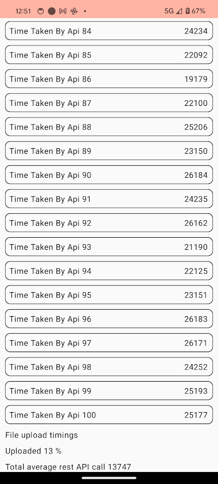

# Why need for this??

There are cases where API calls GET, POST, MULTIPART file uploads happen concurrently in app whose usecase caters lot of
things. And if user's are in good networks areas, we need never concern ourselves with such problem.  
But in some cases like low connectivity areas like remote places, underground areas, in those cases it comes essential
for us to priorities API calls which are running concurrently when network bandwidth is limited.

Many solution can be thought in this direction with respect to when dealing with mobile client

- Upload only over Wifi
- Like pausable downloads
- Using work manager
- Prioritising API calls

In this post we would be seeing how to create a mechanism to prioritise API call over file upload, so that network
bandwidth can be utilised in a better way, rather than letting it go over non critical file uploads.

# Getting ready for Baseline

## Server

We would be creating

- Go lang server
  - GET endpoint
    - Sending 100KB data on response to a request
  - POST endpoint
    - Again sending 100 KB of data
- Android app
  - where it make concurrent
    - 100 GET API calls
    - 100 POST API calls
  - make a file upload of 300 MB

```go
package main

import (
	"fmt"
	"io"
	"os"
    "encoding/json"
    "net/http"
    "strings"
)

// Define a data structure
type ResponseData struct {
	Message string `json:"message"`
	LargeData string `json:"largeData"`
}

func uploadFileHandler(w http.ResponseWriter, r *http.Request) {
	// Parse the multipart form
	if err := r.ParseMultipartForm(10 << 20); err != nil { // Max upload of 10 MB files
		fmt.Print("too large file")
		http.Error(w, err.Error(), http.StatusBadRequest)
		return
	}
	fmt.Print("upload started")

	// Retrieve the file from posted form-data
	file, handler, err := r.FormFile("file")
	if err != nil {

		http.Error(w, err.Error(), http.StatusBadRequest)
		return
	}
	defer file.Close()

	// Create a file in the server's local filesystem to save the uploaded file
	dst, err := os.Create("./uploads/" + handler.Filename)
	if err != nil {
		http.Error(w, err.Error(), http.StatusInternalServerError)
		return
	}
	defer dst.Close()

	// Copy the uploaded file to the destination file
	if _, err := io.Copy(dst, file); err != nil {
		http.Error(w, err.Error(), http.StatusInternalServerError)
		return
	}
	response := ResponseData{
		Message: "Done",
		LargeData: fmt.Sprintf("File uploaded successfully: %s", handler.Filename),
	}
	json.NewEncoder(w).Encode(response)
	fmt.Print("upload ended")
}


func main() {
	fmt.Printf("hello\n")
	fmt.Print("this prints\n")
    http.HandleFunc("/data", func(w http.ResponseWriter, r *http.Request) {
		// Set the Content-Type header
		w.Header().Set("Content-Type", "application/json")

		// Generate a large string to include in the response
		// Note: Adjust the size of the string as necessary to get close to 100KB
		// The exact size needed might vary depending on the overhead of the JSON structure
		largeString := strings.Repeat("a", 1024*100) // This creates a 100KB string of 'a's

		// Create an instance of ResponseData with the large string
		response := ResponseData{
			Message: "This response is approximately 100KB in size.",
			LargeData: largeString,
		}

		// Encode the ResponseData instance to JSON and send it as the response
		json.NewEncoder(w).Encode(response)
	})

    http.HandleFunc("/", func(w http.ResponseWriter, r *http.Request) {
        w.Write([]byte("Hello"))
    })
	http.HandleFunc("/upload", uploadFileHandler)

    http.ListenAndServe(":8080", nil)
}

```

## Android Simple Client

### Android ViewModel

```kotlin

data class MainScreenState(
    val apiTiming: List<Int> = emptyList(),
    val uploadProgress: Float = 0f,
    val uploadTotalTime: Int? = null,
    val averageApiCallTime: Int? = null,
)

private const val TAG = "MainViewModel"

class MainViewModel(private val application: Application) : AndroidViewModel(application) {

    private val _state = MutableStateFlow(
        MainScreenState()
    )
    val state: StateFlow<MainScreenState>
        get() = _state


    // Function to upload file using Retrofit
    fun uploadFile(fileUri: Uri) {
        viewModelScope.launch {
            val response = RetrofitClient.uploadFile(application, fileUri) { progress ->
                _state.update {
                    state.value.copy(
                        uploadProgress = progress.toFloat(),
                    )
                }
            }
            _state.update {
                state.value.copy(
                    uploadTotalTime = response
                )
            }
        }
    }

    fun startRestCalls() {
        viewModelScope.launch {
            val response = performConcurrentApiCallsAndCalculateAverage(
                n = 100,
            )
            _state.update {
                state.value.copy(
                    averageApiCallTime = response.toInt(),
                )
            }
            Log.d(TAG, "total average -> $response")
        }
    }

    private suspend fun performConcurrentApiCallsAndCalculateAverage(n: Int): Double = withContext(
        Dispatchers.IO) {
        val timeTakenList = mutableListOf<Deferred<Int>>()

        for (i in 1..n) {
            val timeTakenDeferred = async { RetrofitClient.getDataFromServer() }
            timeTakenList.add(timeTakenDeferred)
        }

        val totalTimeValues = mutableListOf<Int>()
        val totalTimeTaken = timeTakenList.sumOf {
            val timeConsumed = it.await()
            totalTimeValues.add(timeConsumed)
            addValueToState(timeConsumed)
            timeConsumed
        }
        val averageTimeTaken = totalTimeTaken.toDouble() / n
        println("time take array -> $totalTimeValues")

        averageTimeTaken
    }

    private fun addValueToState(timeConsumed: Int) {
        _state.update {
            state.value.copy(
                apiTiming = state.value.apiTiming + timeConsumed,
            )
        }
    }

}

```

### Retrofit Client

```kotlin
object RetrofitClient {
    private var retrofit: Retrofit? = null

    private fun getClient(baseUrl: String): Retrofit {
        if (retrofit == null) {
            retrofit = Retrofit.Builder()
                .baseUrl(baseUrl)
                .addConverterFactory(GsonConverterFactory.create())
                .build()
        }
        return retrofit!!
    }

    private val apiService = getClient("https://4097-103-87-59-2.ngrok-free.app/").create(ApiService::class.java)

    suspend fun getDataFromServer(): Int {
        val startTime = System.currentTimeMillis()
        return try {
            val responseBody = apiService.fetchData()
            val endTime = System.currentTimeMillis()
            val responseTime = endTime - startTime

            //println("Response time: $responseTime ms")
            responseTime.toInt()
        } catch (e: Exception) {
            e.printStackTrace()
            -1
        }
    }

    suspend fun uploadFile(
        context: Context,
        fileUri: Uri,
        onUpdates: (Int)-> Unit,
    ): Int{
        val parcelFileDescriptor = context.contentResolver.openFileDescriptor(fileUri, "r", null)
        val fileInputStream = FileInputStream(parcelFileDescriptor?.fileDescriptor)
        val file = File(context.cacheDir, context.contentResolver.getFileName(fileUri))
        file.outputStream().use {
            fileInputStream.copyTo(it)
        }

        val requestBody = ProgressRequestBody(
            file,
            "text/plain".toMediaTypeOrNull(),
            object : UploadCallbacks{
                override fun onProgressUpdate(percentage: Int) {
                    Log.d(TAG, "onProgressUpdate $percentage")
                    onUpdates(percentage)
                }

                override fun onError() {
                    Log.d(TAG, "onError ")
                }

                override fun onFinish() {
                    Log.d(TAG, "onFinish ")
                }
            }
        )
        val part = MultipartBody.Part.createFormData("file", file.name, requestBody)

        parcelFileDescriptor?.close()
        return try {
            val startTime = System.currentTimeMillis()
            val call = apiService.uploadFile(part)
            val endTime = System.currentTimeMillis()
            val responseTime = endTime - startTime
            Log.d(TAG, "uploadFile success")
            responseTime.toInt()
        }catch (e: Exception){
            Log.d(TAG, "uploadFile failed ")
            0
        }
    }

}

private fun ContentResolver.getFileName(fileUri: Uri): String {
    var name = ""
    val cursor = query(fileUri, null, null, null, null)
    cursor?.use {
        if (it.moveToFirst()) {
            name = cursor.getString(it.getColumnIndexOrThrow(OpenableColumns.DISPLAY_NAME))
        }
    }
    return name
}


```

### ProgressRequestBody

```kotlin

interface UploadCallbacks {
    fun onProgressUpdate(percentage: Int)
    fun onError()
    fun onFinish()
}

class ProgressRequestBody(
    private val file: File,
    private val contentType: MediaType?,
    private val callbacks: UploadCallbacks
) : RequestBody() {

    override fun contentType(): MediaType? = contentType

    override fun contentLength(): Long = file.length()

    override fun writeTo(sink: BufferedSink) {
        val fileLength = file.length()
        val buffer = ByteArray(DEFAULT_BUFFER_SIZE)
        val inputStream = FileInputStream(file)
        var uploaded: Long = 0

        try {
            var read: Int
            val handler = Handler(Looper.getMainLooper())
            inputStream.use { fileInputStream ->
                while (fileInputStream.read(buffer).also { read = it } != -1) {
                    handler.post(ProgressUpdater(uploaded, fileLength))
                    uploaded += read
                    sink.write(buffer, 0, read)
                }
            }
        } finally {
            inputStream.close()
        }
    }

    private var lastPercent = 0

    private inner class ProgressUpdater(
        private val uploaded: Long,
        private val fileLength: Long
    ) : Runnable {
        override fun run() {
            val currentPercent = ((100 * uploaded) / fileLength).toInt()
            if(lastPercent!=currentPercent){
                callbacks.onProgressUpdate(currentPercent)
            }
            lastPercent = currentPercent
        }
    }

    companion object {
        private const val DEFAULT_BUFFER_SIZE = 2048
    }
}


```

### ApiService

```kotlin

data class ServerResponse(
    val message: String,
    val largeData: String,
)

interface ApiService {

    @GET("/data")
    suspend fun fetchData(): ServerResponse

    @Multipart
    @POST("/upload")
    suspend fun uploadFile(@Part file: MultipartBody.Part): ServerResponse

}

```

## ONLY GET API calls

To being with we would throttle our network speed to Limit 8Mbps with the help
of [charles](https://docs.tealium.com/platforms/android-kotlin/charles-proxy-android/)

1st run - 100 concurrent api calls took 11.6 seconds on average 2nd run - 100 concurrent api calls took 11.1 seconds on
average 2nd run - 100 concurrent api calls took 6.8 seconds on average

## Uploads + GET API calls

1st run - Uploads + 100 concurrent api calls took 5.6 seconds on average 2nd run - Uploads + 100 concurrent api calls
took 5.6 seconds on average

## Cannot see much of an effect here

> Can it be due to effect that I am hitting localhost from mobile and too fast result???

> SSH tunnelling with ngrok, and Charles was not working.

## Ngrok + GET API calls, No network speed bar

On roughly 250+Mbps JIO network (as per speednet)

1st run - 100 concurrent api calls took 3.6 seconds on average 1st run - 100 concurrent api calls took 4.7 seconds on
average

## Ngrok + Upload + GET APIs

1st run - 300 MB file upload + 100 concurrent api calls took 8.8 seconds on average 2nd run - 300 MB file upload + 100
concurrent api calls took 13.8 seconds on average

## Ngrok + Upload + GET APIs on Smart client

### NetworkRequest

```kotlin
data class NetworkRequest<T>(
    // todo make, enum such that high number means high priority
    val priority: Int,
    val operations: suspend () -> T,
    var deferred: CompletableDeferred<T>? = null
)

enum class RequestType {
    API_CALL, FILE_UPLOAD
}

```

### OptimisedApiCalls

```kotlin
class OptimisedApiCalls {

    private val requestQueueManager = RequestQueueManager()

    fun <T> doApiCall(
        call: suspend () -> T,
    ): Deferred<T> {
        val request = NetworkRequest(
            priority = 100,
            operations = call,
        )
        return requestQueueManager.addRequest(request)
    }

    fun<T> doFileUpload(
        call: suspend () -> T,
    ): Deferred<T> {
        val request = NetworkRequest(
            priority = 0,
            operations = call,
        )
        return requestQueueManager.addRequest(request)
    }

}

```

### RequestQueueManager

This below does follow things:

- add request to priority queue
- and make coroutine job of currently executing task
- if new priority task added
  - cancel current JOB
  - prioritise this JOB

```kotlin

class RequestQueueManager {
    private val coroutineScope = CoroutineScope(Dispatchers.IO + SupervisorJob())
    private val priorityQueue = PriorityQueue<NetworkRequest<*>>(compareByDescending { it.priority })
    private var currentJob: Job? = null
    private val mutex = Mutex()

    private lateinit var currentProcessedRequest: NetworkRequest<*>

    fun <T> addRequest(request: NetworkRequest<T>): Deferred<T> {
        val deferred = CompletableDeferred<T>()
        coroutineScope.launch {
            mutex.withLock {
                // Add request to the queue
                request.deferred = deferred
                priorityQueue.add(request)
                // Check if we should preempt the current job
                if (shouldPreempt(request.priority)) {
                    currentJob?.cancel()  // Cancel current job if it is of lower priority
                }
                processQueue()  // Process the queue
            }
        }
        return deferred
    }

    private fun shouldPreempt(newTaskPriority: Int): Boolean {
        if(!::currentProcessedRequest.isInitialized){
            // means first request, hence no preemption
            return false
        }
        // Only preempt if the current task is running and the new task has a higher priority
        Log.d(TAG, "shouldPreempt: active -> ${currentJob?.isActive}")
        Log.d(TAG, "shouldPreempt: newTaskPriority -> $newTaskPriority")
        Log.d(TAG, "shouldPreempt: currentTaskPriority -> ${(currentProcessedRequest.priority)}")
        val should = currentJob?.isActive == true &&
                (currentProcessedRequest.priority) < newTaskPriority
        Log.d(TAG, "shouldPreempt: $should")
        return should
    }

    private fun processQueue() {
        coroutineScope.launch {
            if (currentJob == null || !currentJob!!.isActive) {
                while (priorityQueue.isNotEmpty()) {
                    val request = priorityQueue.peek() as NetworkRequest<Any>
                    currentProcessedRequest = request
                    currentJob = launch {
                        try {
                            Log.d(TAG, "processQueue executing ... ${request.priority}")
                            val result = request.operations.invoke()
                            (request.deferred as CompletableDeferred<Any>).complete(result)
                            priorityQueue.poll()
                        } catch (e: CancellationException) {
                            println("Task was cancelled: ${e.message}")
                            (request.deferred as CompletableDeferred<Any>).cancel(e)
                            priorityQueue.poll()
                        }
                    }
                    currentJob?.join()  // Wait for the current task to complete or be cancelled
                }
            }
        }
    }

}

```

With the above code changes, nothing changes in Viewmodel level, things remains same.

And after this code execution, API calls would be prioritized over uploads



## Code

Complete code can be found [here](https://github.com/Dalakoti07/android-learning/tree/master/uploads)
