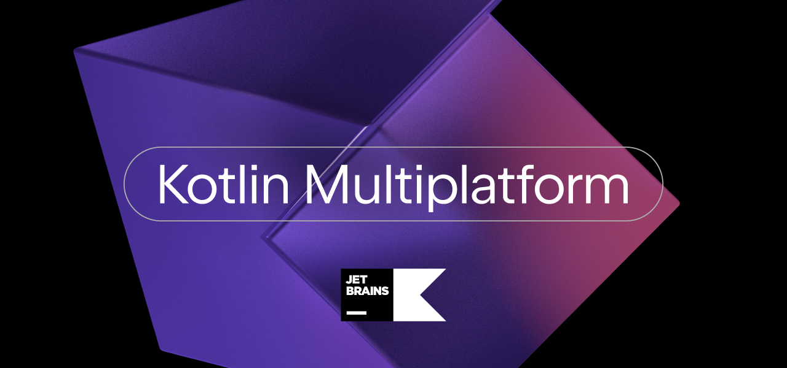
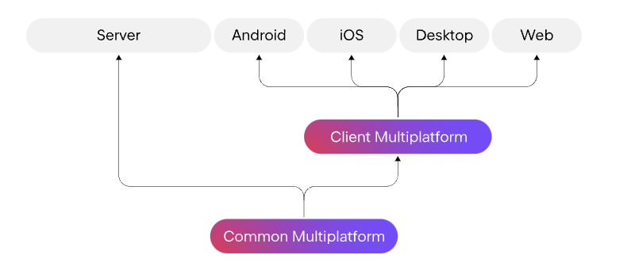
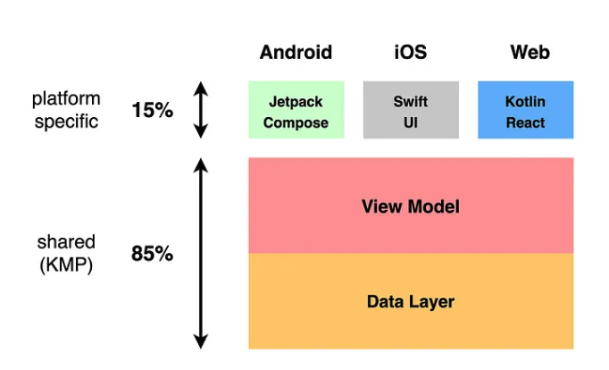
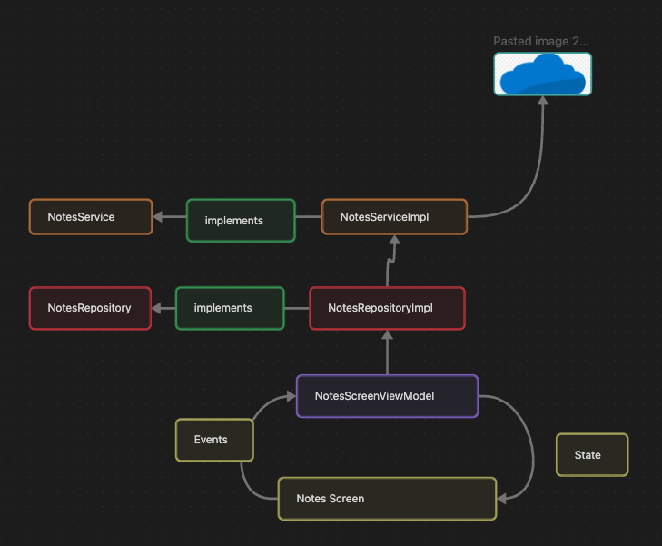
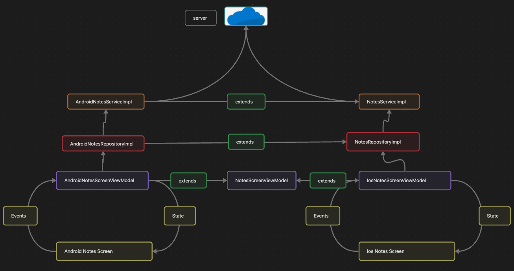
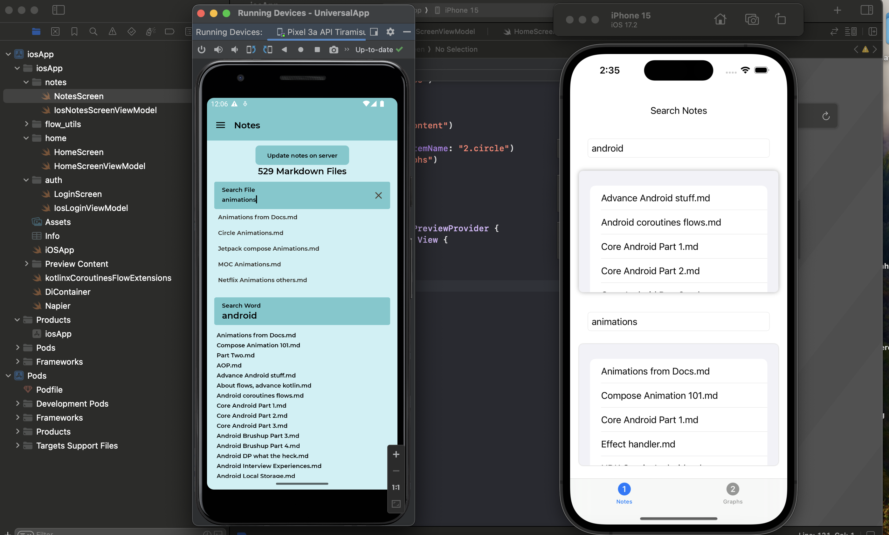

KMP has been here for the while, and idea of having shared code and different UI implementation for different platforms is refreshing and meeting the expectation of native look and feel across the platform. Which means Android App would have google material theme, and IOS would have its own IOS like look and feel.

And what would be shared? All api calls, database management, Unit Tests and integration test upto presentation level (state test cases), and we can have shared state management as well, if all user flow is same across Android and IOS.

This is interesting in cross platform space because
- `Koltin` as a programming language has lot to offer when compared to likes of javascript/typescript and dart.
- Provide option to write
    - native UIs in corresponding platform
    - or Use compose to write common UI elements as well

## From the docs

>The Kotlin Multiplatform technology is designed to simplify the development of cross-platform projects. It reduces time spent writing and maintaining the same code for [different platforms](https://kotlinlang.org/docs/multiplatform.html#kotlin-multiplatform-use-cases) while retaining the flexibility and benefits of native programming.



## Architecture Setup for KMP
As we want to have most of the things shared like
- Data / Core
- Business / domain logic
- presentation (only state management part of it)
    - after sharing the state management part it becomes nothing but UI components in both IOS

And we would have corresponding UI for each platform
- Compose / XML for android
- Swift UI / UI Kit for IOS



taken from [here](https://danielebaroncelli.medium.com/the-future-of-apps-declarative-uis-with-kotlin-multiplatform-d-kmp-part-2-3-1bbadaf19aef)

>A first class app needs to keep **UI/UX patterns** authentic on each platform.

With above approach where even state-management is shared, views in all specific platform becomes dumb.

A classic MVI architecture to make 85% sharable code, let's build it.

>Navigation won't be present in shared code, although it can be achieved, you can view it [here](https://danielebaroncelli.medium.com/the-future-of-apps-declarative-uis-with-kotlin-multiplatform-d-kmp-part-3-3-959a2628526d)
## Let's build it up

I am gonna be discuss the high level overview of the library choices and architecture of the application, and most is inspired from many open source repositories out there in github. Scroll to reference section for it.

### Libraries
- Networking using - [KTOR](https://ktor.io/docs/welcome.html)
- DI
    - [Dagger-Hilt](https://dagger.dev/hilt/) for Android, because it jells well
    - [Koin](https://insert-koin.io/docs/reference/koin-mp/kmp/) for IOS
- [Napier](https://github.com/AAkira/Napier) a KMM library for logging
- [Arrow](https://arrow-kt.io/)
    - Introduces functional paradigm concepts such as Either which says that a variable can hold either of 1 values from 2 options, and this solves the problem of error handling in a neat way
    - get to know more about it from [here](https://www.baeldung.com/kotlin/arrow)
    - so `Either` returns a value or result
- [Kotlin serialisation](https://github.com/Kotlin/kotlinx.serialization)
- [Compose destination](https://github.com/raamcosta/compose-destinations) for navigation

### From bottom up

#### Setting up DI
So that they can provide and create ktor client to make API calls

Ktor engine would get OKHTTP or Darwin client for Android and IOS project.

```kotlin

fun <T : HttpClientEngineConfig> createHttpClient(  
   engineFactory: HttpClientEngineFactory<T>,  
   json: Json,  
   block: T.() -> Unit,  
): HttpClient = HttpClient(engineFactory) {  
   engine(block)  
  
   install(HttpTimeout) {  
      requestTimeoutMillis = 15_000  
      connectTimeoutMillis = 10_000  
      socketTimeoutMillis = 10_000  
   }  
  
   install(ContentNegotiation) {  
      json(json)  
      register(  
         ContentType.Text.Plain,  
         KotlinxSerializationConverter(json),  
      )  
   }  
  
   install(Logging) {  
      level = LogLevel.ALL  
      logger = object : Logger {  
         override fun log(message: String) {  
            Napier.d(message = message, tag = "[HttpClient]")  
         }  
      }  
   }  
}

```

Dagger's provider for creating Http Client

```kotlin

@Provides  
@Singleton  
internal fun httpClient(json: Json, userManager: UserManager): HttpClient = createHttpClient(  
   engineFactory = OkHttp,  
   json = json,  
) {  
   addInterceptor { chain ->  
      val request = chain.request().newBuilder()  
      val user = userManager.getCurrentUser()  
      if (user != null) {  
         request.addHeader("Authorization", "Token ${user.token}")  
      }  
      val response = chain.proceed(request.build())  
      response  
   }  
}

```

Koin's code to provide Http Client

```kotlin

single {  
   val userManager: UserManager = get()  
   createHttpClient(  
      engineFactory = Darwin,  
      json = get()  
   ) {  
      val user = userManager.getCurrentUser()  
      Napier.d("sending user")  
      configureRequest {  
         this.setAllHTTPHeaderFields(  
            mapOf(  
               "Authorization" to "Token ${user?.token}"  
            )  
         )  
      }  
   }}

```

the data flow from UI component to api call would like following, let's take notes screen for example



>The famous `Data goes down and event goes up` like in [REACT](https://medium.com/swlh/understanding-information-flow-in-react-data-down-action-up-b6c792a8b010) or classic MVI setup. Or this is also called Uni-directional flow because data is flow in one direction that from parent to child, or from up to down. And child never mutates the data. Mutation will be done by parent or upstream, so parent is source of truth. And this same concept of React is being adopted by Android for [compose](https://developer.android.com/jetpack/compose/architecture). Although this can be achieved in XML as well 😎.


Let's see how this above dependency is provided by Dagger or koin to android and IOS respectively



So Dagger provides
- `AndroidNotesServiceImpl`
- `AndroidNotesRepositoryImpl`
- `AndroidNotesScreenViewModel`

And Koin provides
- `NotesServiceImpl`
- `NotesRepositoryImpl`
- `NotesScreenViewModel`

Code snippets to get more of gist, code removed or brevity

``` kotlin

open class NotesScreenViewModel(  
   val repository: NotesRepository,  
) : BaseViewModel<NotesScreenState, NotesAction, NotesSingleEvents>(  
   NotesScreenState()  
) {  
   private val debouncerClass = DebouncerClass()  
  
   init {  
      getAllNotes()  
   }  
  
   private fun getAllNotes() {  
      viewModelScope.launch(Dispatchers.Default) {  
         setState {  
            viewState.value.copy(  
               isLoading = true,  
            )  
         }  
         val result = repository.getAllFiles()  
         result.fold(  
            ifRight = {  
               setState {  
                  viewState.value.copy(  
                     allFiles = it,  
                     totalCount = it.size,  
                  )  
               }  
            },  
            ifLeft = {  
               emitSingleEvent(NotesSingleEvents.ApiFailed(it))  
            },  
         )  
         setState {  
            viewState.value.copy(  
               isLoading = false,  
            )  
         }  
      }   }  
  
   private fun searchAKeyword(word: String) {  
      viewModelScope.launch(Dispatchers.Default) {  
         setState {  
            viewState.value.copy(  
               isLoading = true,  
            )  
         }  
         val result = repository.searchKeyword(word)  
         result.fold(  
            ifRight = {  
               setState {  
                  viewState.value.copy(  
                     wordSearchResults = it,  
                  )  
               }  
            },  
            ifLeft = {  
               emitSingleEvent(NotesSingleEvents.ApiFailed(it))  
            },  
         )  
         setState {  
            viewState.value.copy(  
               isLoading = false,  
            )  
         }  
      }   }  
  
   override fun dispatchEvent(action: NotesAction) {  
      setState {  
         action.reduce(viewState.value)  
      }  
      when (action) {  
         is NotesAction.GetNoteContent -> {  
            getFileContent(action.name)  
         }  
         is NotesAction.UpdateNotes -> {  
            updateNotesInServer()  
         }  
         is NotesAction.OnWordSearchChange -> {  
            debouncerClass.execute(scope = viewModelScope, function = {  
               searchAKeyword(action.name)  
            })  
         }  
  
         else -> {}  
      }  
   }  
  
   private fun updateNotesInServer() {  
      // todo here  
   }  
  
   private fun getFileContent(fileName: String) {  
      viewModelScope.launch(Dispatchers.Default) {  
         setState {  
            viewState.value.copy(  
               isLoading = true,  
            )  
         }  
         val result = repository.getFileContent(fileName)  
         result.fold(  
            ifLeft = {  
               emitSingleEvent(NotesSingleEvents.ApiFailed(it))  
            },  
            ifRight = {  
               emitSingleEvent(NotesSingleEvents.NavigateToDetailScreen(it, fileName))  
            },  
         )  
         setState {  
            viewState.value.copy(  
               isLoading = false,  
            )  
         }  
      }   
    }  
    
}

interface NotesRepository {  
  // .... removed for brevity .....
   suspend fun searchKeyword(query: String): Either<AppError, List<String>>  
  // .... removed for brevity .....
}

open class NotesRepositoryImpl(  
   private val service: NotesService,  
   private val errorMapper: AppErrorMapper,  
   private val appCoroutineDispatchers: AppCoroutineDispatchers,  
) : NotesRepository {  
	// .... removed for brevity .....
   override suspend fun getAllFiles(): Either<AppError, List<String>> = withContext(  
      appCoroutineDispatchers.io  
   ) {  
      service.getAllFiles()  
         .mapLeft(errorMapper).tapLeft {  
            Napier.e(  
               message = it.message ?: "",  
               throwable = it,  
               tag = "NotesRepositoryImpl: getAllFiles",  
            )  
         }  
   }
   // .... removed for brevity .....
}

interface NotesService {  
   // .... removed for brevity .....
   suspend fun searchKeyword(query: String): Either<Throwable, List<String>>  
   // .... removed for brevity .....
}

open class NotesServiceImpl(  
   private val httpClient: HttpClient,  
   private val baseUrl: Url,  
   private val appCoroutineDispatchers: AppCoroutineDispatchers,  
) : NotesService {  
  // .... removed for brevity .....
   override suspend fun getAllFiles(): Either<Throwable, List<String>> =  
      withContext(appCoroutineDispatchers.io) {  
         Either.catch {  
            val response = httpClient.get(  
               URLBuilder(baseUrl).apply {  
                  path("notes")  
               }.build(),  
            ) {  
               contentType(ContentType.Application.Json)  
            }  
            response.throwServerErrorMessageIfInNon200Range()  
            response.body()  
         }  
      }
    }
    // .... removed for brevity .....
}

@HiltViewModel  
class AndroidNotesViewModels @Inject constructor(  
   repository: NotesRepository,  
) : NotesScreenViewModel(  
   repository  
)

class AndroidNotesRepository @Inject constructor(  
   service: NotesService,  
   errorMapper: AppErrorMapper,  
   appCoroutineDispatchers: AppCoroutineDispatchers,  
) : NotesRepositoryImpl(  
   service,  
   errorMapper,  
   appCoroutineDispatchers  
)

class AndroidNotesServiceImpl @Inject constructor(  
   httpClient: HttpClient,  
   @ApiEndPoint baseUrl: Url,  
   appCoroutineDispatchers: AppCoroutineDispatchers,  
) : NotesServiceImpl(  
   httpClient,  
   baseUrl,  
   appCoroutineDispatchers,  
)

```

The code above is self explanatory in itself.

> Android implementation wrapper are pretty trivial, as they are created so that dagger can provide them, whereas koin provide Impl only no IOS wrapper over it. The whole idea behind adding hilt as DI for Android was dagger-hilt advantages in Jetpack Compose integration and TDD as well.

### The baseViewModel, delegating Vm responsibilities, MVI Actions, Single time events

```kotlin

abstract class BaseViewModel<S : ViewState, A : UiAction, E : UiEvents>(initialState: S) : com.dalakoti.multiplatformViewmodel.ViewModel() {  
   // Used to post transient events to the View  
   private val _viewState = MutableStateFlow(initialState)  
   val viewState: StateFlow<S> = _viewState  
  
   private val _events = Channel<UiEvents>(Channel.BUFFERED)  
   val events = _events.receiveAsFlow() // expose as flow  
  
   fun emitSingleEvent(event: E) {  
      _events.trySend(event)  
   }  
  
   abstract fun dispatchEvent(action: A)  
  
   private var lastState = initialState  
  
   /**  
    * Always Use [update] to emit new state    
    * https://medium.com/geekculture/atomic-updates-with-mutablestateflow-dc0331724405    
    * */   protected fun setState(reducer: S.() -> S) {  
      val newState = reducer(lastState)  
      lastState = newState  
      _viewState.update {  
         newState  
      }  
   }  
}

```

Idea of delegating some responsibilities to model such that viewModel does not bloat, and we have separation of concern in lot of cases. Here Action data class is acting like a reducer, [concept of reducer in Redux](https://www.freecodecamp.org/news/what-is-redux-store-actions-reducers-explained/#:~:text=Reducers%2C%20as%20the%20name%20suggests,return%20the%20newly%20updated%20state.).

```kotlin

data class NotesScreenState(  
   var isLoading: Boolean = true,  
   var allFiles: List<String> = listOf(),  
   var suggestions: List<String> = listOf(),  
   var query: String = "",  
   var fileContent: String = "",  
   var totalCount: Int = 0,  
   var wordSearchQuery: String = "",  
   var wordSearchResults: List<String> = listOf(),  
) : ViewState

@KSwiftExclude  
sealed interface NotesAction : UiAction {  
  
   fun reduce(state: NotesScreenState): NotesScreenState  
  
   data class GetNoteContent(val name: String) : NotesAction {  
      override fun reduce(state: NotesScreenState): NotesScreenState = state  
   }  
  
   object UpdateNotes : NotesAction {  
      override fun reduce(state: NotesScreenState): NotesScreenState {  
         return state  
      }  
   }  
  
   data class OnQueryChange(val name: String) : NotesAction {  
      override fun reduce(state: NotesScreenState): NotesScreenState {  
         if (name.isEmpty()) {  
            return state.copy(  
               suggestions = emptyList(),  
               query = "",  
            )  
         }  
         return state.copy(  
            suggestions = state.allFiles.filter {  
               it.lowercase().contains(name.lowercase())  
            },  
            query = name,  
         )  
      }  
   }  
  
   data class OnWordSearchChange(val name: String) : NotesAction {  
      override fun reduce(state: NotesScreenState): NotesScreenState {  
         return state.copy(  
            wordSearchQuery = name,  
            wordSearchResults = emptyList(),  
         )  
      }  
   }  
  
   object RefreshHomeScreen : NotesAction {  
      override fun reduce(state: NotesScreenState): NotesScreenState {  
         // reset all data  
         return NotesScreenState()  
      }  
   }  
}

interface NotesSingleEvents : UiEvents {  
  
   class ApiFailed(val appError: AppError) : NotesSingleEvents  
  
   class NavigateToDetailScreen(val content: String, val fileName: String) : NotesSingleEvents  
}


```

Observing single events and view State in compose

```kotlin

@Destination  
@NotesGraph(start = true)
@Composable  
fun NotesScreen(  
   viewModel: AndroidNotesViewModels = hiltViewModel(),  
   navigator: DestinationsNavigator,  
) {  
   val eventFlow = rememberFlowWithLifecycle(flow = viewModel.events)  
   val context = LocalContext.current  
   val state by viewModel.viewState.collectAsStateWithLifecycle()  
   val coroutineScope = rememberCoroutineScope()  
   val snackBarHostState = remember { SnackbarHostState() }  
  
   LaunchedEffect(  
      key1 = eventFlow,  
      block = {  
         eventFlow.collect {  
            when (it) {  
               is NotesSingleEvents.ApiFailed -> {  
                  coroutineScope.launch {  
                     snackBarHostState.showSnackbar(it.appError.getReadableMessage(context))  
                  }  
               }  
  
               is NotesSingleEvents.GotContent -> {  
                  context.startActivity(  
                     Intent(context, ViewNoteActivity::class.java).apply {  
                        putExtra("notes", it.content)  
                        putExtra("fileName", it.fileName.getFileNameFromPath())  
                     },  
                  )  
               }  
            }  
         }  
      },  
   )  
  
   UniverseScaffold(  
      modifier = Modifier  
         .fillMaxSize()  
         .paddingForAppBar(),  
      snackbarHost = {  
         SnackbarHost(  
            hostState = snackBarHostState,  
            modifier = Modifier  
               .systemBarsPadding()  
               .fillMaxWidth()  
               .wrapContentHeight(Alignment.Bottom),  
         )  
      }  
   ) {  
      NotesScreenContent(  
         state = state,  
         dispatchEvent = {  
            viewModel.dispatchEvent(it)  
         },  
      )  
   }  
}

```


This is also good, great and trivial as per Android development state in 2023.  Let us see how IOS gels with this KMM's kotlin part, and how many changes are required for IOS integration.

## IOS Part

>I am not an IOS developer, so code or methodologies used here are something I found works for the project and serves the functional purpose.  Although I found some article using `rxSwift +  coroutine flow` to achieve the same results which are being achieved below. But I decided to go with `callbacks and flows`, no `rxSwift`

Koin setting things up

```kotlin

object DIContainer : KoinComponent {  
   fun init(appDeclaration: KoinAppDeclaration = {}) {  
      Napier.base(  
         if (isDebug()) DebugAntilog()  
         else object : Antilog() {  
            override fun performLog(  
               priority: LogLevel,  
               tag: String?,  
               throwable: Throwable?,  
               message: String?  
            ) {  
               // TODO: Crashlytics  
            }  
         }  
      )  
  
      startKoin {  
         appDeclaration()  
         modules(  
            dataModule,  
            domainModule,  
            appModule,  
            presentationModule,  
         )  
         printLogger(  
            if (isDebug()) {  
               Level.DEBUG  
            } else {  
               Level.ERROR  
            },  
         )  
      }  
   }  
  
   fun get(  
      type: ObjCObject,  
      qualifier: Qualifier? = null,  
      parameters: ParametersDefinition? = null  
   ): Any? = getKoin().get(  
      clazz = when (type) {  
         is ObjCProtocol -> getOriginalKotlinClass(type)!!  
         is ObjCClass -> getOriginalKotlinClass(type)!!  
         else -> error("Cannot convert $type to KClass<*>")  
      },  
      qualifier = qualifier,  
      parameters = parameters,  
   )  
}

```

```swift

// swift App
@main
struct iOSApp: App {
    
    private let userManager: UserManager
    
    init(){
        DIContainer.shared.doInit{ _ in
            
        }
        self.userManager = DIContainer.shared.get()
    }
    
    var body: some Scene {
		WindowGroup {
            if userManager.getCurrentUser() == nil{
                LoginScreen()
            }else{
                NotesScreen()
            }
		}
	}
}

```

```swift

// NotesScreen

struct NotesList: View {
    @State private var userInput: String = ""
    @State private var searchWordInput: String = ""

    var suggestedFileName: [String]
    var onSearchFile: ((String)-> Void)
    var isLoading: Bool
    var onKeywordSearch: ((String)-> Void)
    
    var searchResults: [String]
    
    var body: some View {
        VStack{
            
            if isLoading{
                ProgressView()
            }
            
            Text("Search Notes").padding(15)
            TextField("Search File Name", text: $userInput).padding()
                .textFieldStyle(RoundedBorderTextFieldStyle())
                .autocapitalization(/*@START_MENU_TOKEN@*/.none/*@END_MENU_TOKEN@*/)
                .keyboardType(.emailAddress)
                .onChange(of: userInput, perform: { newText in
                    print("value is \(newText)")
                    onSearchFile(newText)
                })

            // suggestions
            if suggestedFileName.count>0{
                List {
                    ForEach(suggestedFileName, id: \.self) { item in
                        Text(item)
                    }
                }
                .padding(.top, -8)
                .background(Color.white)
                .cornerRadius(8)
                .shadow(radius: 4)
            }
            
            Spacer().frame(height: 20)
            TextField("Search Keyword", text: $searchWordInput).padding()
                .textFieldStyle(RoundedBorderTextFieldStyle())
                .autocapitalization(/*@START_MENU_TOKEN@*/.none/*@END_MENU_TOKEN@*/)
                .keyboardType(.emailAddress)
                .onChange(of: searchWordInput, perform: { newText in
                    print("value is \(newText)")
                    onKeywordSearch(newText)
                })
            List {
                ForEach(searchResults, id: \.self) { item in
                    Text(item)
                }
            }
            .padding(.top, -8)
            .background(Color.white)
            .cornerRadius(8)
            .shadow(radius: 1)
            Spacer()
        }.padding()
    }
}

struct NotesScreen: View {
    
    @ObservedObject var viewModel =  IosNotesScreenViewModel(
        viewModel: DIContainer.shared.get()
    )
 
    var body: some View{
        TabView {
            
            // First Tab
            NotesList(
                suggestedFileName: viewModel.state.suggestions,
                onSearchFile: { text in
                    viewModel.dispatch(action: NotesActionOnQueryChange(name: text)
                    )
                },
                isLoading: viewModel.state.isLoading,
                onKeywordSearch: { text in
                    viewModel.dispatch(action:
                        NotesActionOnWordSearchChange(name: text)
                    )
                },
                searchResults: viewModel.state.wordSearchResults
            )
                .tabItem {
                    Image(systemName: "1.circle")
                    Text("Notes")
                }
            
            // Second Tab
            Text("The Graph content")
                .tabItem {
                    Image(systemName: "2.circle")
                    Text("Graphs")
                }
        }
    }
}


```

`IOSNotesScreenViewModel`, which delegate API call and state management to shared `Viewmodel` and repository.

```swift

// NotesScreenViewModel

@MainActor
class IosNotesScreenViewModel: ObservableObject{

    private let viewModel: NotesScreenViewModel
    
    @Published var state: NotesScreenState
    
    init(viewModel: NotesScreenViewModel) {
        self.viewModel = viewModel
        self.state = viewModel.viewState.value as! NotesScreenState
        addStateListener()
    }
    
    func addStateListener(){
        viewModel.viewState.collect(collector: UiStateCollector<NotesScreenState>(
            onNotify: { newState in
                DispatchQueue.main.async {
                    self.state = newState
                }
            }
        ), completionHandler: { err in
            print("got error \(String(describing: err))")
        })
    }
    
    func observeDataFlow(completion: @escaping (NotesSingleEvents)-> Void){
        viewModel.events.collect(collector: SingleEventCollector<NotesSingleEvents>(
            onNotify: completion
        ), completionHandler: { err in
            print("got error in completion handler \(String(describing: err))")
        })
    }
    
    func dispatch(action: NotesAction)-> Void{
        Napier.d("action -> \(action)")
        self.viewModel.dispatchEvent(action: action)
    }
    
    deinit{
        viewModel.clear()
    }
    
}

```

Or that looks great, but lets see the magical classes which make all these eassy peassy. Well the idea is that use callbacks and mutate `@Published` which would make View aware.

```swift

// SingleEventCollector
class SingleEventCollector<T>: Subscriber, FlowCollector{
    typealias Input = T
    
    typealias Failure = Never
    
    private var onNotify: ((T)-> Void)
    
    init(onNotify:@escaping ( (T) -> Void)) {
        self.onNotify = onNotify
    }
    
    func receive(subscription: Subscription) {
        subscription.request(.unlimited)
    }
    
    func receive(_ input: Input) -> Subscribers.Demand {
        return .unlimited
    }
    
    func receive(completion: Subscribers.Completion<Never>) {
        switch completion{
        case .finished:
            print("flow completed")
        case .failure(let error):
            print("error \(error)")
        }
    }
    
    func emit(value: Any?) async throws {
        let event = value as! T
        // print("value \(String(describing: event))")
        onNotify(event)
    }
}


// StateCollector
class UiStateCollector<T>: Subscriber, FlowCollector{
    typealias Input = T
    
    typealias Failure = Never
    
    private var onNotify: ((T)-> Void)
    
    init(onNotify:@escaping ( (T) -> Void)) {
        self.onNotify = onNotify
    }
    
    func receive(subscription: Subscription) {
        subscription.request(.unlimited)
    }
    
    func receive(_ input: Input) -> Subscribers.Demand {
        return .unlimited
    }
    
    func receive(completion: Subscribers.Completion<Never>) {
        switch completion{
        case .finished:
            print("flow completed")
        case .failure(let error):
            print("error \(error)")
        }
    }
    
    func emit(value: Any?) async throws {
        let event = value as! T
        // print("value \(String(describing: event))")
        onNotify(event)
    }
}

```

## Ah ha moment, after all these things 🔥

[](https://vimeo.com/896680930 "Video Title")


Video is [here](https://vimeo.com/896680930)  on Vimeo


## Verdicts
- IOS looks cool by default 😂
    - Long live Steve, legacy continues
    - But development in IOS is a bit OFF beat, more about it [here](https://domburf.medium.com/apple-development-sucks-539a5caadc9a)
- In Android you have to work hard to make things pleasing to eyes
    - will get there, compose to 🚀

## Why KMM?
- Shared codebase, high usability across the team
- Code a CORE, BUSINESS LOGIC once and re-use it across the platforms
- Flexibility to create platform specific UIs or custom design system using Compose multi-platform, hence providing flexibility.
- Better developer experience in Kotlin as compared to Dart or Javascript, for Flutter and React Native
- And this can be spanned across
    - websites using Kotlin web assembly, WASM
    - for desktops apps

## Resources
- [Improving shared architecture for a Kotlin Multiplatform, Jetpack Compose and SwiftUI app](https://www.marcogomiero.com/posts/2022/improved-kmm-shared-app-arch/)
- [https://www.marcogomiero.com/posts/2020/kmm-shared-app-architecture/](https://www.marcogomiero.com/posts/2020/kmm-shared-app-architecture/)
- [writing-swift-friendly-kotlin-multiplatform-apis](https://proandroiddev.com/writing-swift-friendly-kotlin-multiplatform-apis-part-ix-flow-d4b6ada59395)
- [kotlin-multiplatform-rx-mvvm](https://proandroiddev.com/kotlin-multiplatform-rx-mvvm-1fb21280a0b5)
- [D-KMP, future of Apps](https://danielebaroncelli.medium.com/the-future-of-apps-declarative-uis-with-kotlin-multiplatform-d-kmp-part-2-3-1bbadaf19aef)
- [Amazing repo by hoc081098](https://github.com/hoc081098/GithubSearchKMM)
- [Apple development sucks](https://domburf.medium.com/apple-development-sucks-539a5caadc9a) (No IOS developers were harmed 🥲)


If you found this article helpful, please do give a clap and don't forget to say hi on [Twitter](https://twitter.com/dalakoti07) or [Linkedin](https://www.linkedin.com/in/saurabh-d-990930145/)

